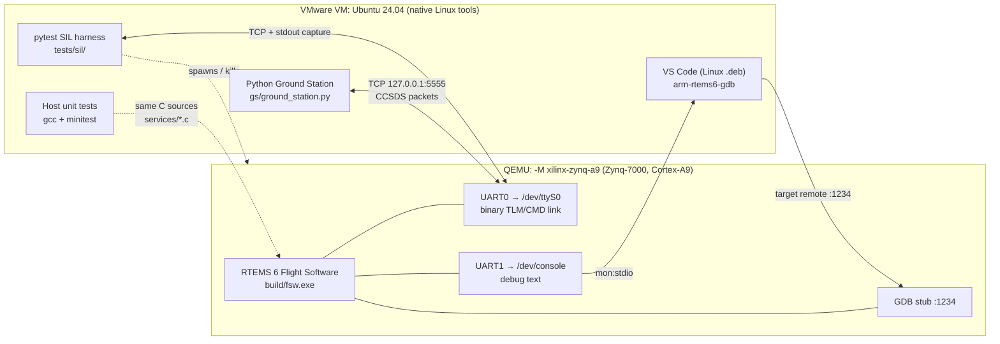
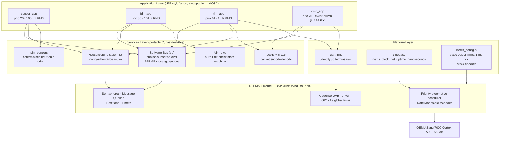
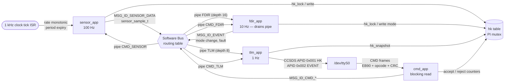
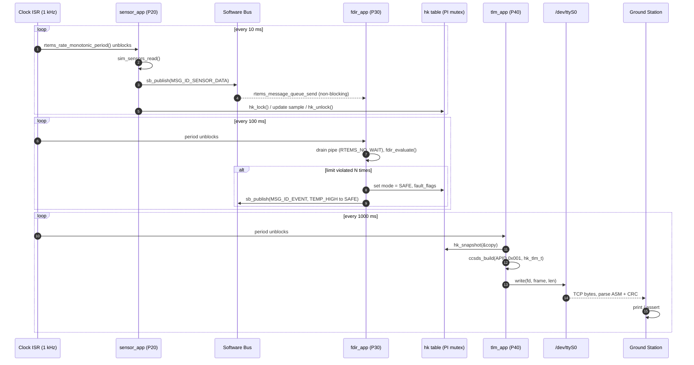
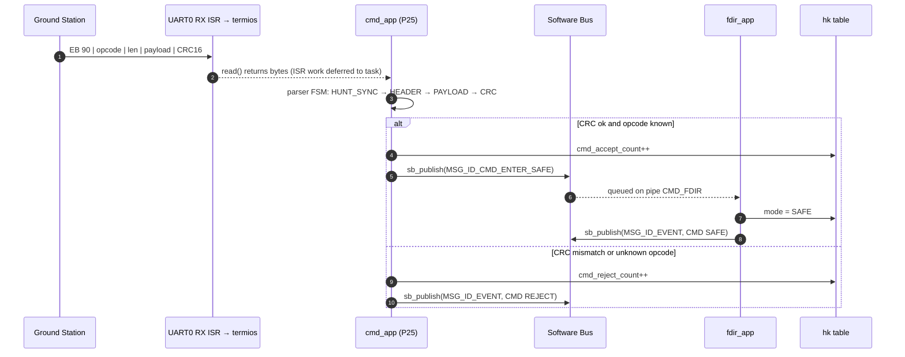
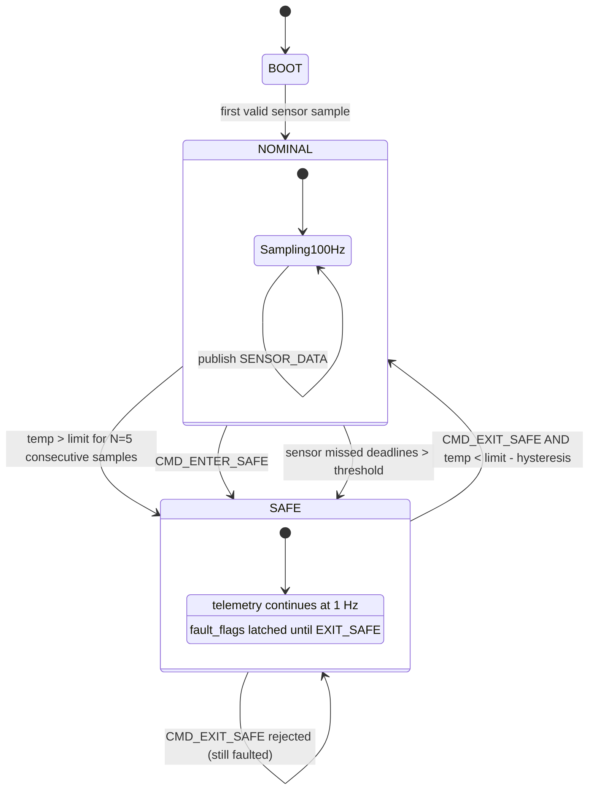
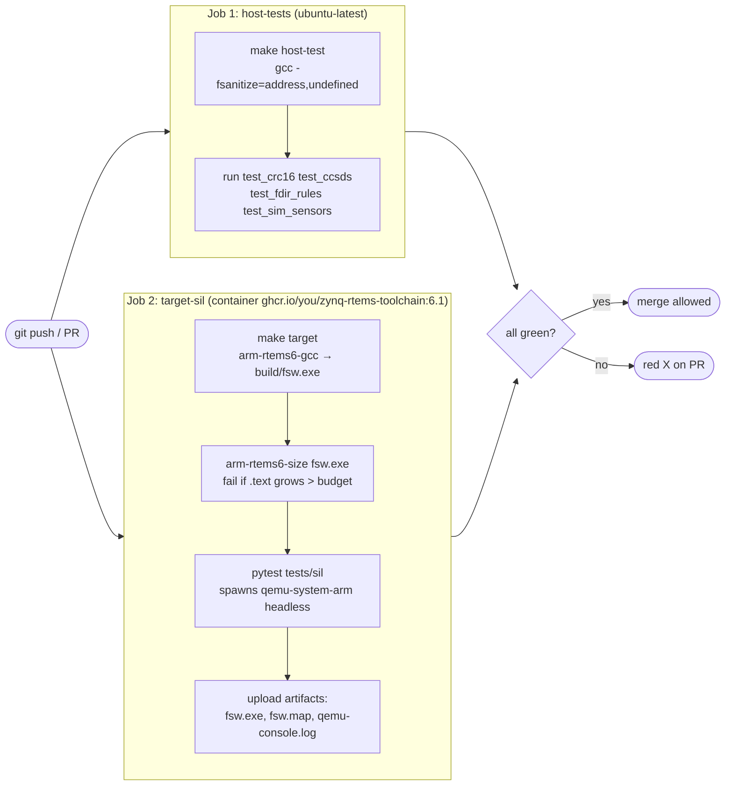
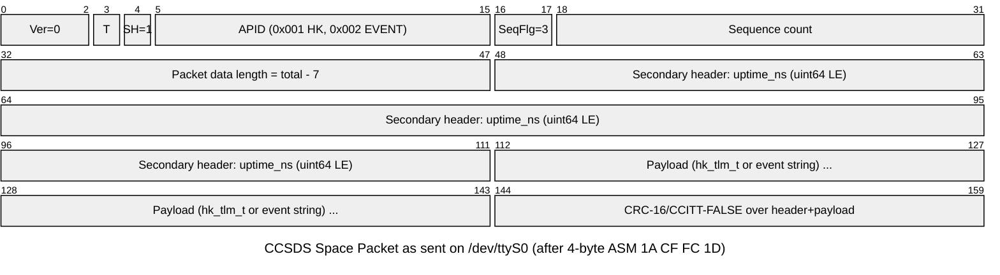
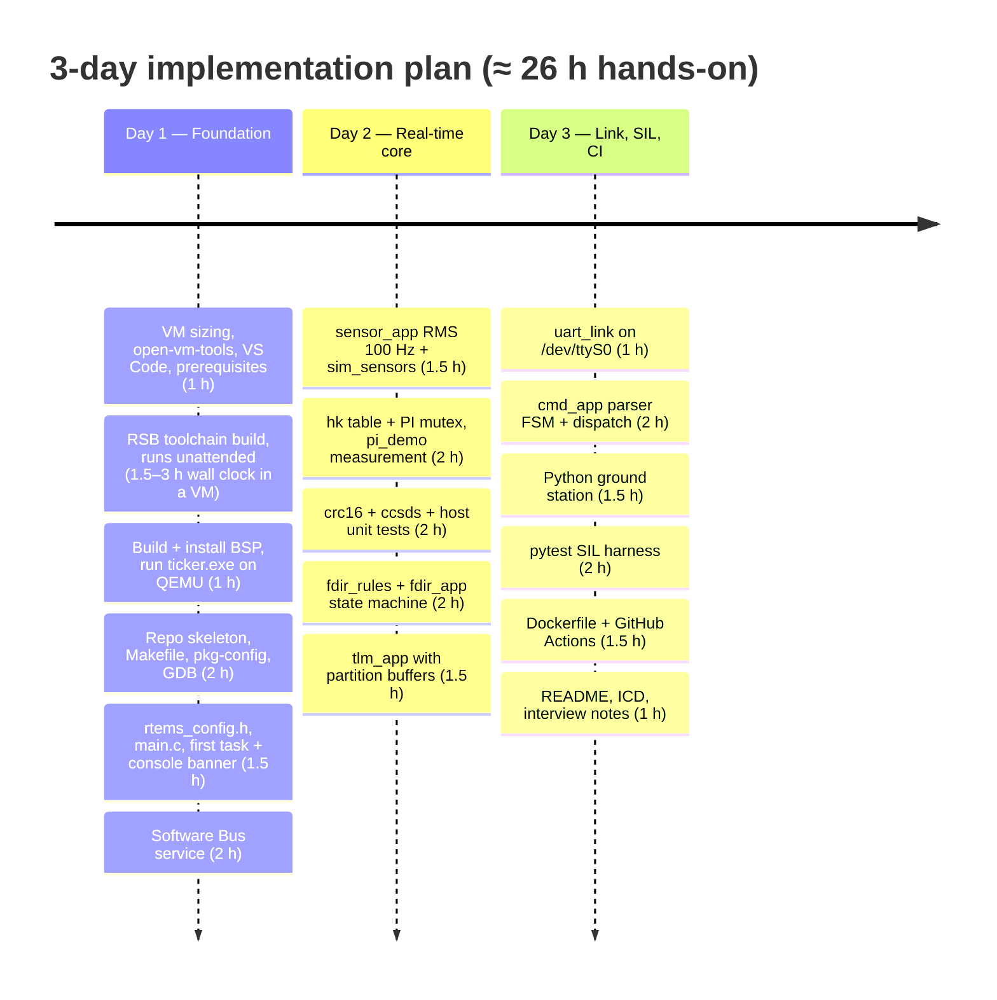

# Zynq-7000 RTEMS Flight Software Demonstrator — Architecture & Step-by-Step Build Guide (Ubuntu 24.04 VMware VM edition)

> **Environment:** This edition assumes your development host is an **Ubuntu 24.04 virtual machine running under VMware** (Workstation Pro/Player on Windows or Linux, or Fusion on macOS). Everything — toolchain, BSP, QEMU, VS Code, Python, Docker — lives *inside* the VM. There is no WSL2 and no Windows-side tooling involved. QEMU emulates the ARM Cortex-A9 in software (TCG), so **nested virtualization is not required**.
>
> **Purpose:** A 3-day, tutorial project to aquire familiarity with the concepts need by emmbedded software engineers in the context of flight software development including: hard real-time scheduling on RTEMS, priority-inheritance mutexes, ISR-to-task deferral, static memory, software-bus (cFS-style) messaging, CCSDS telemetry/commanding, FDIR, Software-in-the-Loop testing on QEMU, and a CI pipeline.
>
> **You write the code.** This document gives you the architecture, the folder/file layout, and every step I would have written — read them, understand them, implement them yourself.

---

## Table of Contents

1. [What you are building (and why this design)](#1-what-you-are-building-and-why-this-design)
2. [Architecture](#2-architecture)
3. [Project structure (folders & files)](#3-project-structure-folders--files)
4. [Interface Control Document (packet formats)](#4-interface-control-document-packet-formats)
5. [Step-by-step implementation guide](#5-step-by-step-implementation-guide)
   - [Day 0 (evening before) — VM setup and kick off the toolchain build](#day-0-evening-before--vm-setup-and-kick-off-the-toolchain-build)
   - [Day 1 — Foundation: toolchain, BSP, skeleton, Software Bus](#day-1--foundation-toolchain-bsp-skeleton-software-bus)
   - [Day 2 — Real-time core: RMS sensor task, PI mutex, packets, FDIR, telemetry](#day-2--real-time-core-rms-sensor-task-pi-mutex-packets-fdir-telemetry)
   - [Day 3 — Link, commanding, ground station, SIL tests, CI](#day-3--link-commanding-ground-station-sil-tests-ci)
6. [Stretch goals (if time remains)](#6-stretch-goals-if-time-remains)
7. [Troubleshooting](#7-troubleshooting)
8. [Interview talking points](#8-interview-talking-points)
9. [Time estimate — can you do it in 3 days?](#9-time-estimate--can-you-do-it-in-3-days)

---

## 1. What you are building (and why this design)

Your suggested project notes ([RTEMS-projects-2.md](RTEMS-projects-2.md)) suggest a heterogeneous MPSoC with Linux + cFS + RTEMS + OpenAMP. That is a great *story*, but it is a 2–3 week project with high bring-up risk (AArch64 secure-mode boot, OpenAMP on QEMU). For a **3-day** window you want something that:

- Runs reliably on the **`xilinx_zynq_a9_qemu`** BSP (your [RTEMS-Simulator.md](RTEMS-Simulator.md) decision — correct choice).
- Demonstrates **every** kernel concept in the tutorial requirements list in [RTEMS-projects-2.md](RTEMS-projects-2.md): RMS, priority preemption, PI mutexes, message queues, ISR deferral, static memory, deadline monitoring, race/deadlock avoidance.
- Is shaped like real flight software (cFS-style apps on a software bus, CCSDS packets, FDIR modes, housekeeping telemetry) so the *architecture* conversation is credible even without the real cFS.
- Has a **host-side ground station and automated SIL tests** so you can become familiar with CI for flight software.

**The system:** a single-board flight computer (Zynq-7000, Cortex-A9, emulated) running RTEMS 6. Four "apps" run on a publish/subscribe software bus:

| App | Rate / trigger | Priority | Role |
|---|---|---|---|
| `sensor_app` | 100 Hz, Rate Monotonic | 20 (highest app) | Samples a simulated IMU + temperature, publishes `SENSOR_DATA`, updates housekeeping |
| `cmd_app` | Event-driven (UART RX) | 25 | Parses uplinked command frames, validates CRC, dispatches via software bus |
| `fdir_app` | 10 Hz, Rate Monotonic | 30 | Fault Detection/Isolation/Recovery: limit checks, deadline monitoring, mode state machine (BOOT/NOMINAL/SAFE) |
| `tlm_app` | 1 Hz (commandable), Rate Monotonic | 40 | Builds CCSDS housekeeping & event packets, writes them out UART0 |

The host talks to the flight computer through QEMU's UART0 mapped to a TCP socket. A Python ground station decodes telemetry and sends commands; `pytest` drives the same link for automated Software-in-the-Loop tests.

**Why this maps to an aerospace and defense technology company's language:**

- *MOSA / modular open systems:* apps only depend on the software bus and message IDs; you can delete `fdir_app` and nothing else recompiles.
- *Determinism:* fixed priorities, RMS periods, no `malloc` after init, message publish never blocks, bounded queues with drop counters.
- *SIL testing:* the entire binary is exercised headless in QEMU under `pytest` in CI, exactly as a prime would do before HIL.
- *C&DH conventions:* CCSDS Space Packet headers, APIDs, sequence counts, CRC-16, ASM framing.

---

## 2. Architecture

### 2.1 System context (host ↔ emulated target)



**Notes:**

- Everything lives inside one Ubuntu VM. The left box is the *host* side (your tools); the right box is the *target* side (QEMU pretending to be a Zynq-7000 board). No physical hardware is involved.
- The flight software (`fsw.exe`) is an RTEMS 6 executable that QEMU boots on an emulated Cortex-A9. It talks to the outside world through two emulated UARTs and a GDB stub.
- UART0 is the *mission* link: binary CCSDS telemetry and command frames appear on `/dev/ttyS0` inside RTEMS. QEMU forwards those bytes to a TCP socket on `127.0.0.1:5555`, which is how the Python ground station and the pytest SIL harness reach the target.
- UART1 is the *debug* console (`/dev/console`): `printf` text that QEMU redirects to your terminal via `mon:stdio`, so you can read logs without polluting the binary link.
- The GDB stub on port `:1234` lets VS Code attach `arm-rtems6-gdb` and single-step RTEMS tasks running inside QEMU.
- The dotted lines show two important indirect relationships: the pytest harness *spawns and kills* the QEMU process for each test run, and the host unit tests compile the *same* `services/*.c` sources with native `gcc` — no cross-compiler or emulator needed for those tests.

**Key fact:** the Zynq BSP registers both UARTs as `/dev/ttyS0` and `/dev/ttyS1`, and on the `xilinx_zynq_a9_qemu` variant the *console* is UART1. That is why the RTEMS docs run QEMU with `-serial null -serial mon:stdio`. We replace the `null` with a TCP socket and get a free binary link on `/dev/ttyS0` while keeping human-readable debug on the console.

### 2.2 Layered software architecture



**Notes:**

- The software is stacked in four layers, top to bottom: **Applications**, **Services**, **Platform**, and the **RTEMS kernel/BSP**, with the emulated hardware at the bottom. Each layer only calls downward.
- The **Application layer** holds four cFS-style apps, each an RTEMS task with its own priority and rate: `sensor_app` (100 Hz), `fdir_app` (10 Hz), `tlm_app` (1 Hz), and the event-driven `cmd_app`. They are deliberately independent so any one can be swapped out (the MOSA principle).
- The **Services layer** is shared, reusable logic. The Software Bus (`sb`) routes messages between apps; the housekeeping table (`hk`) is the shared state protected by a priority-inheritance mutex; `ccsds`/`crc16`, `fdir_rules`, and `sim_sensors` are pure C with no RTEMS dependency.
- The **Platform layer** wraps the OS-specific details: `uart_link` opens `/dev/ttyS0` in raw termios mode, `timebase` reads the RTEMS uptime clock, and `rtems_config.h` sizes the kernel statically (object limits, 1 ms tick, stack checker).
- The **Kernel/BSP** supplies the priority-preemptive scheduler, Rate Monotonic Manager, IPC primitives, and the Cadence UART/GIC/timer drivers for the `xilinx_zynq_a9_qemu` BSP.
- Follow the arrows: apps never touch the UART driver or kernel IPC directly — they go through `uart_link`, `sb`, and `hk`. Only `sb.c` and `hk.c` in the Services layer reach down into RTEMS IPC; everything else in Services is portable, which is what makes host-side unit testing possible.

Design rule: **nothing in `services/` except `sb.c` and `hk.c` includes `<rtems.h>`.** That lets `gcc` on the host compile and unit-test `crc16`, `ccsds`, `fdir_rules`, `sim_sensors` with sanitizers.

### 2.3 Task & data-flow view



**Notes:**

- The whole system is driven by a 1 kHz clock tick. Rate-monotonic period expiry wakes `sensor_app` every 10 ms; the same mechanism (not shown to avoid clutter) wakes `fdir_app` every 100 ms and `tlm_app` every 1000 ms.
- **Downstream data path:** `sensor_app` publishes a `sensor_sample_t` on the Software Bus under `MSG_ID_SENSOR_DATA`. The bus routing table copies it into the FDIR pipe (depth 16, so 10 samples per 100 ms period fit with headroom). `fdir_app` drains that pipe, evaluates limits, and publishes `MSG_ID_EVENT` messages that the bus routes into the TLM pipe (depth 8).
- **Shared state path:** `sensor_app` and `fdir_app` write the latest sample and current mode into the housekeeping table under `hk_lock`; `tlm_app` takes an atomic `hk_snapshot` copy so it never holds the lock while doing slow UART I/O. The cylinder shape marks `hk` as the single shared data store.
- **Downlink:** `tlm_app` encodes the snapshot as CCSDS packets (APID `0x001` for housekeeping, `0x002` for events) and writes them to `/dev/ttyS0`.
- **Uplink:** command frames (sync `EB90`, opcode, CRC) arrive on the same UART. `cmd_app` sits in a blocking `read()`, parses frames, and publishes `MSG_ID_CMD_*` messages. The bus fans those out to per-app command pipes (`CMD_SENSOR`, `CMD_FDIR`, `CMD_TLM`), so each app checks its own pipe on its own schedule — no cross-task function calls.
- `cmd_app` also bumps accept/reject counters in the `hk` table so the ground can see command outcomes in the next telemetry frame.

Priorities (RTEMS: **lower number = higher priority**, 1 = highest, 255 = lowest):

| Task | Priority | Justification |
|---|---|---|
| `Init` | 1 | Creates everything, then deletes itself (or runs demos) |
| `sensor_app` | 20 | Shortest period (10 ms) → highest priority (Rate Monotonic assignment) |
| `cmd_app` | 25 | Sporadic; must not be starved by periodic loops, but must never delay sampling |
| `fdir_app` | 30 | 100 ms period |
| `tlm_app` | 40 | 1000 ms period, does the slow UART writes |
| Idle | 255 | RTEMS built-in |

### 2.4 Telemetry pipeline (sequence)



Step by step (numbers match the diagram):

**Every 10 ms — `sensor_app`, priority 20**

1. The 1 kHz clock ISR detects that the sensor task's rate-monotonic period has expired and unblocks `sensor_app` from `rtems_rate_monotonic_period()`. Because it is the highest-priority application task, it preempts whatever else is running.
2. `sensor_app` calls `sim_sensors_read()` to get a deterministic IMU/temperature sample.
3. It publishes the sample on the Software Bus as `MSG_ID_SENSOR_DATA`.
4. The bus delivers the message to the FDIR pipe with a non-blocking `rtems_message_queue_send`. If the pipe were full the send would fail and be counted, not block — the sensor task must never wait on a consumer.
5. `sensor_app` takes the housekeeping mutex, writes the latest sample, and releases it. The critical section is a few dozen bytes of memcpy, so the lock is held for microseconds.

**Every 100 ms — `fdir_app`, priority 30**

6. The clock ISR unblocks `fdir_app` at its period boundary.
7. `fdir_app` drains its pipe with `RTEMS_NO_WAIT` (typically 10 samples accumulated since the last run) and feeds each through `fdir_evaluate()`.
8. *Only if* a limit has been violated N consecutive times: `fdir_app` locks the hk table and sets `mode = SAFE` plus the relevant `fault_flags`.
9. It then publishes an `MSG_ID_EVENT` describing the transition (e.g., `TEMP_HIGH → SAFE`) so the ground learns *why* the mode changed.

**Every 1000 ms — `tlm_app`, priority 40**

10. The clock ISR unblocks `tlm_app`.
11. `tlm_app` calls `hk_snapshot(&copy)` — a short locked memcpy of the entire hk table into a local buffer — then releases the lock before doing anything slow.
12. It encodes the snapshot into a CCSDS packet with APID `0x001` (`hk_tlm_t` payload), including sequence count and CRC16.
13. It writes the frame to `/dev/ttyS0` with a blocking `write()`. This is the slowest operation in the system, which is why it belongs to the lowest-priority periodic task.
14. QEMU forwards the UART bytes over TCP to the ground station, which hunts for the attached sync marker (ASM), validates the CRC, and decodes the fields.
15. The ground station prints the decoded telemetry or, when running under pytest, asserts on field values.

### 2.5 Command pipeline (sequence)



Step by step (numbers match the diagram):

1. The ground station sends a command frame: sync bytes `EB 90`, an opcode, a length byte, the payload, and a CRC16 trailer. The bytes travel over TCP into QEMU, which presents them to the emulated Cadence UART0.
2. The UART RX interrupt fires inside the BSP driver, which copies bytes into the termios input buffer and wakes `cmd_app`, blocked in `read()`. The dashed arrow marks this as an asynchronous hand-off: the ISR does the minimum and defers all real work to the task.
3. `cmd_app` feeds each byte through a small parser state machine: `HUNT_SYNC` (looking for `EB 90`) → `HEADER` (opcode + length) → `PAYLOAD` → `CRC`. Because bytes may arrive in arbitrary chunks, the FSM carries state across `read()` calls.

**Happy path — CRC matches and the opcode is recognised:**

4. `cmd_app` increments `cmd_accept_count` in the hk table so the acceptance shows up in the next telemetry frame.
5. It publishes the decoded command on the Software Bus, e.g. `MSG_ID_CMD_ENTER_SAFE`. `cmd_app` itself never changes system mode — it only translates bytes into messages.
6. The bus queues the message on the `CMD_FDIR` pipe. Nothing else happens until `fdir_app` next runs.
7. On its next 100 ms period, `fdir_app` drains the command pipe, sees `CMD_ENTER_SAFE`, and sets `mode = SAFE` in the hk table. Mode ownership stays entirely with FDIR.
8. `fdir_app` publishes an `MSG_ID_EVENT` (`CMD SAFE`) so the ground gets an explicit acknowledgement of the transition, not just a changed mode field.

**Reject path — CRC mismatch or unknown opcode:**

9. `cmd_app` increments `cmd_reject_count` in the hk table.
10. It publishes an `MSG_ID_EVENT` (`CMD REJECT`) so the operator sees the rejection in the event stream and can correlate it with what was sent.

Note the ISR-deferral pattern: the Cadence UART RX interrupt runs in the BSP driver, pushes bytes into the termios buffer, and wakes the blocked `read()` in `cmd_app`. Your task code never runs in interrupt context — that is the pattern interviewers want you to articulate.

### 2.6 FDIR mode state machine



**Notes:**

- The system has three top-level modes. It starts in **BOOT** and moves to **NOMINAL** as soon as the first valid sensor sample arrives — this proves the sensor path is alive before the system claims to be healthy.
- Three independent triggers take the system from **NOMINAL** to **SAFE**: a temperature limit exceeded for N=5 *consecutive* samples (a single spike is filtered out), an explicit `CMD_ENTER_SAFE` from the ground, or the sensor task missing more deadlines than the configured threshold (a timing fault, not a data fault).
- Leaving **SAFE** is deliberately harder than entering it. `CMD_EXIT_SAFE` alone is not enough — the temperature must also have dropped below the limit *minus a hysteresis band*. If the fault is still present the command is rejected and the state loops back to `SAFE`. This prevents the ground from bouncing the system in and out of safe mode while the fault persists.
- Inside **NOMINAL**, the sub-state `Sampling100Hz` runs continuously and publishes `SENSOR_DATA` every cycle.
- Inside **SAFE**, the sub-state `TlmOnly` keeps the 1 Hz telemetry flowing so the ground always has visibility, and `fault_flags` stay latched until an accepted `EXIT_SAFE` — so an operator can see *what* triggered safe mode even if the raw condition has since cleared.

### 2.7 Priority-inversion demonstration (what `pi_demo.c` measures)

```mermaid
gantt
    title Priority inversion demo (pi_demo.c) — 3 tasks, 1 shared mutex
    dateFormat X
    axisFormat %L ms
    section Without inheritance
    L holds mutex (prio 30)         :l1, 0, 10
    H blocks on mutex (prio 10)     :crit, h1, 10, 350
    M runs busy loop (prio 20)      :active, m1, 10, 310
    L resumes, releases             :l2, 310, 350
    H finally runs                  :done, h2, 350, 360
    section With RTEMS_INHERIT_PRIORITY
    L holds mutex (prio 30)         :l3, 0, 10
    H blocks, L boosted to prio 10  :crit, h3, 10, 50
    L finishes at prio 10, releases :l4, 10, 50
    H runs immediately              :done, h4, 50, 60
    M runs only after H             :active, m2, 60, 360
```



**Notes:**

- Three tasks share one mutex: **L** (low, prio 30) holds it, **H** (high, prio 10) needs it, and **M** (medium, prio 20) does not use it at all but has a long busy loop. Time runs left to right in milliseconds.
- **Top section — without priority inheritance:** L takes the mutex at t=0. At t=10 H wakes, tries to lock, and blocks. Now M becomes runnable; being higher priority than L, it preempts L and runs its busy loop for ~300 ms. L cannot run to release the mutex, so H — the *highest* priority task in the system — is stuck waiting on the *medium* task that has nothing to do with the mutex. Only when M finishes at t≈310 does L resume, release at t≈350, and let H finally run. H's blocking time is ~340 ms.
- **Bottom section — with `RTEMS_INHERIT_PRIORITY`:** the same sequence begins, but the moment H blocks on the mutex at t=10, the kernel boosts L to H's priority (10). L now outranks M, finishes its critical section at t≈50, and releases. H runs immediately; M does not get the CPU until H is done. H's blocking time drops to ~40 ms — bounded by L's critical section, not by M's unrelated work.
- The lesson: without inheritance, H's worst-case blocking is unbounded by anything it controls. With inheritance it is bounded by the longest critical section of any lower-priority task that shares the mutex — a number you can measure and budget.

You will print the measured blocking time of H in both configurations. Expect ~340 ms vs ~40 ms. This is the Mars Pathfinder story with numbers you generated yourself.

### 2.8 CI pipeline



**Notes:**

- A push or pull request fans out into two independent jobs that run in parallel.
- **Job 1 — host-tests** runs on a plain `ubuntu-latest` runner with no cross-toolchain. It compiles the portable `services/` sources with native `gcc` under AddressSanitizer and UBSan, then runs the four unit-test binaries (`test_crc16`, `test_ccsds`, `test_fdir_rules`, `test_sim_sensors`). This job is fast and catches logic bugs and memory errors before anything touches RTEMS.
- **Job 2 — target-sil** runs inside a pre-built container image that already has `arm-rtems6-gcc`, the BSP, and QEMU installed, so CI never rebuilds the toolchain. It cross-compiles `fsw.exe`, then checks the binary size against a budget (fail the build if `.text` grows past it — a flight-software habit), then runs the pytest SIL suite, which spawns a headless `qemu-system-arm`, drives the real UART link over TCP, and asserts on decoded telemetry. Finally it uploads `fsw.exe`, the linker map, and the captured QEMU console log as artifacts for post-mortem.
- Both jobs feed a single gate. Only if *both* are green is the PR allowed to merge; otherwise the PR shows a red X. Host tests alone are not sufficient — the target job proves the code actually boots and behaves on the (emulated) hardware.

---

## 3. Project structure (folders & files)

Create the repo as `zynq-rtems-fsw/` on the **VM's own virtual disk** (e.g. `~/projects/zynq-rtems-fsw`), *not* inside a VMware shared folder (`/mnt/hgfs/...`). Builds on a shared folder are 5–10× slower, and `hgfs` has quirks with symlinks, `mmap` and file permissions that break `waf` and the RSB. Use `git` (or `scp`) to move code between host and VM, not shared folders.

```
zynq-rtems-fsw/
├── README.md                         # 1-page pitch + how to build/run (write last)
├── LICENSE                           # MIT or BSD-2 (RTEMS is BSD-2)
├── .gitignore                        # build/, *.exe, *.map, __pycache__/, .pytest_cache/
├── Makefile                          # target build, host tests, run, debug, sil
│
├── .github/
│   └── workflows/
│       └── ci.yml                    # host-tests job + target-sil job (container)
│
├── .vscode/
│   ├── launch.json                   # GDB attach to QEMU :1234
│   ├── tasks.json                    # make target / make run
│   └── c_cpp_properties.json         # IntelliSense include paths for RTEMS headers
│
├── docker/
│   └── Dockerfile                    # Reproducible toolchain + BSP + QEMU image
│
├── docs/
│   ├── architecture.md               # Copy of Section 2 diagrams
│   ├── icd.md                        # Interface Control Doc: packet formats (Section 4)
│   └── interview-notes.md            # Your talking points (Section 8)
│
├── scripts/
│   ├── env.sh                        # export RTEMS_PREFIX, PATH, PKG_CONFIG_PATH
│   ├── setup-prereqs.sh              # apt-get everything
│   ├── build-toolchain.sh            # RSB: 6/rtems-arm
│   ├── build-bsp.sh                  # waf configure/build/install xilinx_zynq_a9_qemu
│   ├── run-qemu.sh                   # interactive run: TLM on TCP 5555, console on stdio
│   └── debug-qemu.sh                 # same + -s -S for GDB
│
├── fsw/                              # ── Flight software (cross-compiled for ARM) ──
│   ├── main.c                        # Init task: create objects, start apps, delete self
│   │
│   ├── config/
│   │   ├── rtems_config.h            # confdefs: static object limits, tick, stack checker
│   │   └── fsw_config.h              # periods, priorities, stack sizes, limits, pipe depths
│   │
│   ├── platform/
│   │   ├── timebase.h                # uint64_t now_ns(void)
│   │   ├── timebase.c
│   │   ├── uart_link.h               # open/read/write /dev/ttyS0 in raw mode
│   │   └── uart_link.c
│   │
│   ├── services/                     # portable; only sb.c and hk.c touch RTEMS
│   │   ├── fsw_types.h               # sensor_sample_t, hk_tlm_t, fsw_mode_t (packed, LE)
│   │   ├── msg_ids.h                 # MSG_ID_* enum + CMD opcodes + APIDs
│   │   ├── crc16.h / crc16.c         # CRC-16/CCITT-FALSE
│   │   ├── ccsds.h / ccsds.c         # Space Packet build/parse + ASM framing
│   │   ├── sb.h / sb.c               # Software Bus over RTEMS message queues
│   │   ├── hk.h / hk.c               # Housekeeping table + PI mutex
│   │   ├── fdir_rules.h / fdir_rules.c   # pure FDIR state machine
│   │   └── sim_sensors.h / sim_sensors.c # deterministic sensor model + fault injection
│   │
│   ├── apps/
│   │   ├── sensor_app.h / sensor_app.c
│   │   ├── fdir_app.h   / fdir_app.c
│   │   ├── tlm_app.h    / tlm_app.c
│   │   └── cmd_app.h    / cmd_app.c
│   │
│   └── demos/
│       ├── pi_demo.h / pi_demo.c     # priority inversion measurement
│       └── isr_demo.h / isr_demo.c   # timer-ISR → semaphore → task latency histogram
│
├── tests/
│   ├── host/                         # ── native gcc unit tests ──
│   │   ├── minitest.h                # 30-line assert/report macros
│   │   ├── test_crc16.c
│   │   ├── test_ccsds.c
│   │   ├── test_fdir_rules.c
│   │   └── test_sim_sensors.c
│   │
│   └── sil/                          # ── pytest Software-in-the-Loop ──
│       ├── conftest.py               # fixture: spawn QEMU, connect TCP, teardown
│       ├── test_boot.py              # console prints "FSW READY", no fatal errors
│       ├── test_telemetry.py         # HK packets arrive at ~1 Hz, CRC valid, counters sane
│       ├── test_commands.py          # NOOP accepted, bad CRC rejected, SET_TLM_PERIOD honored
│       └── test_fdir.py              # INJECT_FAULT → SAFE mode → EXIT_SAFE recovers
│
├── gs/                               # ── Python ground station ──
│   ├── __init__.py
│   ├── crc16.py                      # must match fsw/services/crc16.c bit-for-bit
│   ├── packets.py                    # CCSDS parse, hk_tlm_t struct, command frame build
│   ├── link.py                       # TCP client with ASM re-sync + framing
│   ├── ground_station.py             # CLI: live HK display, send commands
│   └── requirements.txt              # pytest, pytest-timeout
│
└── build/                            # gitignored: target/*.o, host/*, fsw.exe, fsw.map
```

---

## 4. Interface Control Document (packet formats)

### 4.1 Downlink: telemetry frame on `/dev/ttyS0`



- **ASM** (Attached Sync Marker) `1A CF FC 1D` precedes every packet so the ground can resynchronize on a byte stream.
- **Primary header (6 bytes, big-endian per CCSDS 133.0-B):** version 0, type 0 (TM), secondary-header flag 1, APID, sequence flags `11` (unsegmented), 14-bit sequence count, and *packet data length* = (bytes after primary header) − 1.
- **Secondary header:** 8-byte `uptime_ns`, little-endian (native ARM; documented here, so it's a legitimate ICD choice).
- **Payload:** `hk_tlm_t` (56 bytes, packed, little-endian) for APID `0x001`; NUL-terminated string ≤ 48 bytes for APID `0x002`.
- **CRC-16/CCITT-FALSE** (poly `0x1021`, init `0xFFFF`, no reflection, no xor-out), big-endian, computed over primary header through payload. Test vector: `"123456789"` → `0x29B1`.

`hk_tlm_t` (Python `struct` format `<IBBHHHIIfffffffIHH`, 56 bytes):

| Field | Type | Meaning |
|---|---|---|
| `uptime_ms` | u32 | Since boot |
| `mode` | u8 | 0 BOOT, 1 NOMINAL, 2 SAFE |
| `fault_flags` | u8 | bit0 TEMP_HIGH, bit1 DEADLINE_MISS, bit2 CMD_SAFE |
| `cmd_accept_count` | u16 | |
| `cmd_reject_count` | u16 | |
| `sensor_missed_deadlines` | u16 | from `rtems_rate_monotonic_period()` returning `RTEMS_TIMEOUT` |
| `sensor_sample_count` | u32 | |
| `sb_drop_count` | u32 | publishes dropped because a pipe was full |
| `gyro_dps[3]` | f32×3 | |
| `accel_g[3]` | f32×3 | |
| `temp_c` | f32 | |
| `sensor_max_wall_us` | u32 | max wall time of one sensor period (from RMS statistics) |
| `tlm_period_ms` | u16 | current commanded telemetry period |
| `reserved` | u16 | 0 |

### 4.2 Uplink: command frame

| Bytes | Field | Notes |
|---|---|---|
| 0–1 | Sync `EB 90` | classic CCSDS TC start sequence |
| 2 | `opcode` | see table |
| 3 | `len` | payload length 0–32 |
| 4…4+len | payload | little-endian |
| last 2 | CRC-16/CCITT-FALSE | big-endian, over `opcode`…payload |

| Opcode | Name | Payload | Effect |
|---|---|---|---|
| `0x00` | `NOOP` | — | increments `cmd_accept_count` only |
| `0x01` | `RESET_COUNTERS` | — | zeros counters in hk |
| `0x02` | `SET_TLM_PERIOD` | u16 ms (100–5000) | `tlm_app` changes its RMS period |
| `0x03` | `SET_TEMP_LIMIT` | f32 °C | `fdir_app` limit |
| `0x04` | `ENTER_SAFE` | — | `fdir_app` → SAFE |
| `0x05` | `EXIT_SAFE` | — | `fdir_app` → NOMINAL if healthy |
| `0x06` | `INJECT_FAULT` | f32 temp offset | `sensor_app` adds offset to sim (test hook) |

---

## 5. Step-by-step implementation guide

Conventions: `$` = a terminal inside the Ubuntu 24.04 VM (GNOME Terminal, or the VS Code integrated terminal). `RTEMS_PREFIX=$HOME/rtems/6`. You will type every file yourself; fragments below are the essential parts — where I write `/* ... */`, fill in the obvious.

### Day 0 (evening before) — VM setup and kick off the toolchain build

The RTEMS Source Builder (RSB) compiles binutils, GCC, newlib, GDB from source. It runs **45–120 min** unattended on bare metal; inside a VM budget **1.5–3 h** depending on how many vCPUs you give it. Start it the night before so Day 1 begins with a ready compiler.

**Step 0.1 — Size and prepare the VMware VM**

If the VM is not created yet, create it from the Ubuntu 24.04 Desktop ISO with at least:

| Resource | Minimum | Recommended | Why |
|---|---|---|---|
| vCPUs | 4 | 6–8 (leave ≥2 for the host) | RSB and `waf -j$(nproc)` scale linearly; QEMU + pytest + VS Code run concurrently on Day 3 |
| RAM | 8 GB | 12–16 GB | GCC bootstrap peaks at several GB; QEMU adds 256 MB + host overhead |
| Disk | 40 GB | 60 GB (thin-provisioned, single file) | RSB scratch ≈ 10 GB, installed toolchain ≈ 2 GB, Docker image ≈ 3 GB |
| Network | NAT | NAT | Only outbound HTTPS is needed (ftp.rtems.org, apt, GitHub) |

VMware settings that matter:

- **Processors → Virtualization engine:** leave "Virtualize Intel VT-x/EPT or AMD-V/RVI" *unchecked* unless you also plan to run x86 KVM guests inside the VM. `qemu-system-arm` emulating a Cortex-A9 uses TCG (pure software emulation) and does not need it.
- **Options → Shared Folders:** fine to enable for convenience, but do not build there (see §3).
- **Host power settings:** disable host sleep/hibernate for the night. A suspended VM stalls the RSB build and can confuse `make` timestamps when it resumes.
- Take a **snapshot** after Step 0.2 finishes ("clean prerequisites") and another after the toolchain installs ("toolchain ready"). If you break the environment later, revert instead of debugging it.

Inside the freshly installed Ubuntu:

```bash
sudo apt-get update && sudo apt-get upgrade -y
sudo apt-get install -y open-vm-tools open-vm-tools-desktop     # clipboard, resolution, time sync with the host
sudo reboot
```

`open-vm-tools` also keeps the guest clock in step with the host, which matters because the SIL tests measure wall-clock telemetry rates.

**Install VS Code natively in the VM** (do not use the Snap — it sandboxes `$HOME` oddly and breaks GDB paths):

```bash
sudo apt-get install -y wget gpg apt-transport-https
wget -qO- https://packages.microsoft.com/keys/microsoft.asc | gpg --dearmor | sudo tee /usr/share/keyrings/packages.microsoft.gpg > /dev/null
echo "deb [arch=amd64 signed-by=/usr/share/keyrings/packages.microsoft.gpg] https://packages.microsoft.com/repos/code stable main" | sudo tee /etc/apt/sources.list.d/vscode.list
sudo apt-get update && sudo apt-get install -y code
code --install-extension ms-vscode.cpptools --install-extension ms-python.python
```

There is no "Remote" extension to configure: VS Code, the compiler, GDB and QEMU are all in the same Linux userspace, so `launch.json` paths are plain Linux paths.

**Step 0.2 — prerequisites** — `scripts/setup-prereqs.sh`

```bash
#!/usr/bin/env bash
set -euo pipefail
sudo apt-get update
sudo apt-get install -y \
  build-essential g++ gdb git curl unzip pax bison flex texinfo \
  python3 python3-dev python3-pip python3-venv python-is-python3 \
  libncurses-dev zlib1g-dev libexpat1-dev libtinfo-dev \
  pkg-config ninja-build netcat-openbsd xxd \
  qemu-system-arm
qemu-system-arm --version
```

**Step 0.3 — environment file** — `scripts/env.sh` (source it in every new shell; add `source ~/projects/zynq-rtems-fsw/scripts/env.sh` to `~/.bashrc`)

```bash
export RTEMS_PREFIX="$HOME/rtems/6"
export RTEMS_BSP="xilinx_zynq_a9_qemu"
export RTEMS_ARCH="arm-rtems6"
export PATH="$RTEMS_PREFIX/bin:$PATH"          # prepend, never overwrite the system PATH
export PKG_CONFIG_PATH="$RTEMS_PREFIX/lib/pkgconfig${PKG_CONFIG_PATH:+:$PKG_CONFIG_PATH}"
```

**Step 0.4 — build the toolchain** — `scripts/build-toolchain.sh`

Use the **6.1 release tarballs** (frozen, reproducible) rather than git `main` (which is RTEMS 7 development and changes daily).

```bash
#!/usr/bin/env bash
set -euo pipefail
source "$(dirname "$0")/env.sh"
SRC="$HOME/rtems/src"
mkdir -p "$SRC" && cd "$SRC"

if [ ! -d rsb ]; then
  curl -L https://ftp.rtems.org/pub/rtems/releases/6/6.1/sources/rtems-source-builder-6.1.tar.xz | tar xJf -
  mv rtems-source-builder-6.1 rsb
fi

cd rsb/rtems
../source-builder/sb-check                 # verifies host prerequisites
../source-builder/sb-set-builder --prefix="$RTEMS_PREFIX" 6/rtems-arm   2>&1 | tee "$SRC/toolchain-build.log"

"$RTEMS_PREFIX/bin/arm-rtems6-gcc" --version
```

Run it and go to bed:

```bash
$ chmod +x scripts/*.sh && ./scripts/setup-prereqs.sh && nohup ./scripts/build-toolchain.sh > /dev/null 2>&1 &
```

VM-specific cautions for the overnight run:

- `nohup … &` survives closing the terminal, but **not** suspending the VM or letting the host laptop sleep. Leave the VM window open (or minimized) and the host plugged in.
- If you must close the VM, use VMware's *Suspend* rather than *Power Off*; the build resumes where it left off. Check progress in the morning with `tail -f ~/rtems/src/toolchain-build.log`.
- Give the VM every vCPU you can spare for the night; you can lower it again the next day (VM must be powered off to change the count).

> **Learning checkpoint:** Why can't you use Ubuntu's `arm-none-eabi-gcc`? Because RTEMS needs newlib configured for RTEMS, thread-aware GCC runtime libs, the `__rtems__` define, and multilib variants matching the BSP's `-mfpu=neon -mfloat-abi=hard`. (This is a real interview question.)

---

### Day 1 — Foundation: toolchain, BSP, skeleton, Software Bus

#### Step 1.1 — Build and install the BSP (≈ 10 min compile on bare metal, 15–25 min in a 4-vCPU VM)

`scripts/build-bsp.sh`:

```bash
#!/usr/bin/env bash
set -euo pipefail
source "$(dirname "$0")/env.sh"
SRC="$HOME/rtems/src"; cd "$SRC"

if [ ! -d rtems-6.1 ]; then
  curl -L https://ftp.rtems.org/pub/rtems/releases/6/6.1/sources/rtems-6.1.tar.xz | tar xJf -
fi
cd rtems-6.1

cat > config.ini <<EOF
[arm/xilinx_zynq_a9_qemu]
BUILD_SAMPLES = True
RTEMS_POSIX_API = True
RTEMS_DEBUG = False
EOF

./waf configure --prefix="$RTEMS_PREFIX"
./waf -j"$(nproc)"
./waf install

ls "$RTEMS_PREFIX/lib/pkgconfig/"        # expect arm-rtems6-xilinx_zynq_a9_qemu.pc
```

`config.ini` is the RTEMS 6 build-system input: one section per BSP, key = value options. `BUILD_SAMPLES` gives you `hello.exe` and `ticker.exe` to prove the emulator works before you write a line of code.

#### Step 1.2 — Prove the emulator works

```bash
$ qemu-system-arm -M xilinx-zynq-a9 -m 256M -no-reboot -nographic \
    -serial null -serial mon:stdio \
    -kernel ~/rtems/src/rtems-6.1/build/arm/xilinx_zynq_a9_qemu/testsuites/samples/ticker.exe
```

You should see `*** BEGIN OF TEST CLOCK TICK ***`, three tasks printing timestamps, `*** END OF TEST ***`, and QEMU exits (because `-no-reboot` turns the BSP's reset-at-exit into a QEMU exit). If it hangs, press `Ctrl-A` then `x`.

> **Learning checkpoint:** Open `testsuites/samples/ticker/tasks.c` and `init.c`. Notice `rtems_task_wake_when`, `rtems_clock_get_tod`, and the `CONFIGURE_*` block. That block is what you write next.

#### Step 1.3 — Repo skeleton

```bash
$ mkdir -p ~/projects/zynq-rtems-fsw && cd ~/projects/zynq-rtems-fsw && git init
$ mkdir -p fsw/{config,platform,services,apps,demos} tests/{host,sil} gs scripts docs docker .github/workflows .vscode
$ printf 'build/\n*.exe\n*.map\n__pycache__/\n.pytest_cache/\n*.log\n' > .gitignore
```

#### Step 1.4 — RTEMS configuration — `fsw/config/rtems_config.h`

This file is the "static resource budget" of the system. Every object type has a hard maximum; there is no `CONFIGURE_UNLIMITED_OBJECTS`. Exactly one `.c` file defines `CONFIGURE_INIT` before including it.

```c
#ifndef RTEMS_CONFIG_H
#define RTEMS_CONFIG_H

#include "fsw_config.h"      /* SB_PIPE_DEPTH_MAX, SB_MSG_MAX_SIZE, ... */

/* Drivers */
#define CONFIGURE_APPLICATION_NEEDS_CLOCK_DRIVER
#define CONFIGURE_APPLICATION_NEEDS_CONSOLE_DRIVER

/* 1 ms tick: 10 ms sensor period = 10 ticks, jitter resolution 1 ms */
#define CONFIGURE_MICROSECONDS_PER_TICK        1000

/* Static object budget — count them, don't guess. Over-budget = rtems_*_create fails at init. */
#define CONFIGURE_MAXIMUM_TASKS                10   /* Init + 4 apps + 3 pi_demo + isr_demo + spare */
#define CONFIGURE_MAXIMUM_SEMAPHORES           10   /* hk mutex, sb mutex, isr_demo sem, pi_demo mutex, termios */
#define CONFIGURE_MAXIMUM_MESSAGE_QUEUES        6   /* FDIR, TLM, CMD_SENSOR, CMD_FDIR, CMD_TLM + spare */
#define CONFIGURE_MAXIMUM_PARTITIONS            2   /* tlm packet buffers */
#define CONFIGURE_MAXIMUM_PERIODS               4   /* sensor, fdir, tlm + spare */
#define CONFIGURE_MAXIMUM_TIMERS                4   /* isr_demo */
#define CONFIGURE_MAXIMUM_FILE_DESCRIPTORS      8   /* stdin/out/err + /dev/ttyS0 + spare */

/* Message queue storage is carved out of the workspace at boot */
#define CONFIGURE_MESSAGE_BUFFER_MEMORY \
  ( CONFIGURE_MESSAGE_BUFFERS_FOR_QUEUE(SB_PIPE_DEPTH_MAX, SB_MSG_MAX_SIZE) * CONFIGURE_MAXIMUM_MESSAGE_QUEUES )

/* Catch stack overflows in development builds — a classic flight-software bug class */
#define CONFIGURE_STACK_CHECKER_ENABLED

/* Init task */
#define CONFIGURE_RTEMS_INIT_TASKS_TABLE
#define CONFIGURE_INIT_TASK_STACK_SIZE         (32 * 1024)
#define CONFIGURE_INIT_TASK_PRIORITY           1
#define CONFIGURE_INIT_TASK_ATTRIBUTES         RTEMS_FLOATING_POINT
#define CONFIGURE_INIT_TASK_INITIAL_MODES      RTEMS_DEFAULT_MODES

#include <rtems/confdefs.h>
#endif
```

#### Step 1.5 — Tunables — `fsw/config/fsw_config.h`

Keep every "magic number" here so an interviewer can see the schedule at a glance.

```c
#ifndef FSW_CONFIG_H
#define FSW_CONFIG_H

/* Periods (ms) — harmonic set: 10 / 100 / 1000 */
#define SENSOR_PERIOD_MS        10u
#define FDIR_PERIOD_MS         100u
#define TLM_PERIOD_DEFAULT_MS 1000u
#define TLM_PERIOD_MIN_MS      100u
#define TLM_PERIOD_MAX_MS     5000u

/* Priorities — rate monotonic assignment: shorter period → higher priority (smaller number) */
#define PRIO_SENSOR   20
#define PRIO_CMD      25
#define PRIO_FDIR     30
#define PRIO_TLM      40

/* Stacks */
#define STACK_APP     (16 * 1024)

/* Software bus */
#define SB_MAX_PAYLOAD       64
#define SB_MSG_MAX_SIZE      (16 + SB_MAX_PAYLOAD)    /* header fields + payload, see sb.h */
#define SB_MAX_ROUTES        16
#define SB_MAX_SUBS_PER_MSG   4
#define SB_PIPE_DEPTH_MAX    16

/* FDIR defaults */
#define FDIR_TEMP_LIMIT_C          60.0f
#define FDIR_TEMP_HYSTERESIS_C      5.0f
#define FDIR_TEMP_CONSECUTIVE       5
#define FDIR_MISSED_DEADLINE_LIMIT 10

/* Link */
#define UART_LINK_DEVICE "/dev/ttyS0"
#endif
```

#### Step 1.6 — Shared types — `fsw/services/fsw_types.h` and `fsw/services/msg_ids.h`

`fsw_types.h` (no RTEMS includes — host-testable):

```c
#ifndef FSW_TYPES_H
#define FSW_TYPES_H
#include <stdint.h>

typedef enum { FSW_MODE_BOOT = 0, FSW_MODE_NOMINAL = 1, FSW_MODE_SAFE = 2 } fsw_mode_t;

#define FAULT_TEMP_HIGH     (1u << 0)
#define FAULT_DEADLINE_MISS (1u << 1)
#define FAULT_CMD_SAFE      (1u << 2)

typedef struct {
    uint64_t timestamp_ns;
    uint32_t sequence;
    float    gyro_dps[3];
    float    accel_g[3];
    float    temp_c;
} sensor_sample_t;                       /* travels on the software bus */

typedef struct __attribute__((packed)) {
    uint32_t uptime_ms;
    uint8_t  mode;
    uint8_t  fault_flags;
    uint16_t cmd_accept_count;
    uint16_t cmd_reject_count;
    uint16_t sensor_missed_deadlines;
    uint32_t sensor_sample_count;
    uint32_t sb_drop_count;
    float    gyro_dps[3];
    float    accel_g[3];
    float    temp_c;
    uint32_t sensor_max_wall_us;
    uint16_t tlm_period_ms;
    uint16_t reserved;
} hk_tlm_t;                               /* travels to the ground: 56 bytes */

_Static_assert(sizeof(hk_tlm_t) == 56, "hk_tlm_t layout changed — update gs/packets.py and docs/icd.md");
#endif
```

`msg_ids.h`:

```c
#ifndef MSG_IDS_H
#define MSG_IDS_H
/* Software-bus message IDs */
enum {
    MSG_ID_SENSOR_DATA     = 0x0100,   /* payload: sensor_sample_t */
    MSG_ID_EVENT           = 0x0200,   /* payload: NUL-terminated string */
    MSG_ID_CMD_RESET_CTRS  = 0x0301,
    MSG_ID_CMD_SET_TLM_PER = 0x0302,   /* payload: uint16_t ms */
    MSG_ID_CMD_SET_TEMP_LIM= 0x0303,   /* payload: float */
    MSG_ID_CMD_ENTER_SAFE  = 0x0304,
    MSG_ID_CMD_EXIT_SAFE   = 0x0305,
    MSG_ID_CMD_INJECT_FAULT= 0x0306,   /* payload: float */
};
/* Uplink opcodes (wire) */
enum { CMD_NOOP=0x00, CMD_RESET_COUNTERS=0x01, CMD_SET_TLM_PERIOD=0x02, CMD_SET_TEMP_LIMIT=0x03,
       CMD_ENTER_SAFE=0x04, CMD_EXIT_SAFE=0x05, CMD_INJECT_FAULT=0x06 };
/* Downlink APIDs */
#define APID_HK    0x001
#define APID_EVENT 0x002
#endif
```

#### Step 1.7 — First `main.c` and a Makefile that links

`fsw/main.c` (minimal for now; you will add app starts on Day 2):

```c
#include <rtems.h>
#include <stdio.h>
#include <stdlib.h>
#include "fsw_config.h"
#include "timebase.h"

static void fatal(const char *what, rtems_status_code sc)
{
    printf("FATAL: %s failed: %s\n", what, rtems_status_text(sc));
    exit(1);                                   /* triggers BSP reset → QEMU exits (-no-reboot) */
}

rtems_task Init(rtems_task_argument arg)
{
    (void)arg;
    printf("\n=== Zynq-7000 RTEMS FSW demonstrator ===\n");
    printf("RTEMS %s | tick = %u us | uptime %llu ns\n",
           rtems_get_version_string(),
           (unsigned)rtems_configuration_get_microseconds_per_tick(),
           (unsigned long long)now_ns());

    /* Day 2: sb_init(); hk_init(); start apps here */

    printf("FSW READY\n");
    rtems_task_delete(RTEMS_SELF);             /* Init's job is done; apps carry on */
}

#define CONFIGURE_INIT
#include "rtems_config.h"
```

`fsw/platform/timebase.h/.c`:

```c
/* timebase.h */
#include <stdint.h>
uint64_t now_ns(void);

/* timebase.c */
#include <rtems.h>
#include "timebase.h"
uint64_t now_ns(void) { return rtems_clock_get_uptime_nanoseconds(); }
```

`Makefile` — the important trick is `pkg-config`: the RTEMS 6 build installs a `.pc` file per BSP that yields the exact `-march/-mfpu/-mfloat-abi`, `-qrtems`, `-B<bsp lib>`, `-specs bsp_specs` flags. Never hand-copy those.

```make
# ── toolchain ────────────────────────────────────────────────────────────────
RTEMS_PREFIX ?= $(HOME)/rtems/6
RTEMS_ARCH   ?= arm-rtems6
RTEMS_BSP    ?= xilinx_zynq_a9_qemu
PKG           = $(RTEMS_ARCH)-$(RTEMS_BSP)
export PKG_CONFIG_PATH := $(RTEMS_PREFIX)/lib/pkgconfig

CC      = $(RTEMS_PREFIX)/bin/$(RTEMS_ARCH)-gcc
SIZE    = $(RTEMS_PREFIX)/bin/$(RTEMS_ARCH)-size
GDB     = $(RTEMS_PREFIX)/bin/$(RTEMS_ARCH)-gdb
HOSTCC  = gcc

INCS    = -Ifsw -Ifsw/config -Ifsw/platform -Ifsw/services -Ifsw/apps -Ifsw/demos
WARN    = -Wall -Wextra -Werror -Wshadow -Wundef -std=gnu11

TGT_CFLAGS  = $(shell pkg-config --cflags $(PKG)) -O2 -g -ffunction-sections -fdata-sections $(WARN) $(INCS)
TGT_LDFLAGS = $(shell pkg-config --libs $(PKG)) -Wl,--gc-sections -Wl,-Map=build/fsw.map
ifdef DEMO
TGT_CFLAGS += -DFSW_RUN_PI_DEMO          # make DEMO=1 → runs pi_demo before starting apps
endif

# ── sources ──────────────────────────────────────────────────────────────────
FSW_SRC := $(wildcard fsw/*.c fsw/platform/*.c fsw/services/*.c fsw/apps/*.c fsw/demos/*.c)
FSW_OBJ := $(patsubst %.c,build/target/%.o,$(FSW_SRC))

PORTABLE_SRC := fsw/services/crc16.c fsw/services/ccsds.c fsw/services/fdir_rules.c fsw/services/sim_sensors.c
HOST_TESTS   := $(patsubst tests/host/%.c,build/host/%,$(wildcard tests/host/test_*.c))
HOST_CFLAGS  = -O0 -g -fsanitize=address,undefined -fno-omit-frame-pointer $(WARN) $(INCS) -Itests/host -DFSW_HOST_BUILD

# ── targets ──────────────────────────────────────────────────────────────────
.PHONY: all target host-test run debug sil size clean
all: target

target: build/fsw.exe size

build/fsw.exe: $(FSW_OBJ)
	$(CC) $(TGT_CFLAGS) $^ -o $@ $(TGT_LDFLAGS)

build/target/%.o: %.c
	@mkdir -p $(dir $@)
	$(CC) $(TGT_CFLAGS) -MMD -MP -c $< -o $@

size: build/fsw.exe
	$(SIZE) $<

host-test: $(HOST_TESTS)
	@for t in $^; do echo "── $$t"; $$t || exit 1; done

build/host/%: tests/host/%.c $(PORTABLE_SRC)
	@mkdir -p $(dir $@)
	$(HOSTCC) $(HOST_CFLAGS) $^ -o $@

run: build/fsw.exe
	./scripts/run-qemu.sh $<

debug: build/fsw.exe
	./scripts/debug-qemu.sh $<

sil: build/fsw.exe
	python3 -m pytest tests/sil -v

clean:
	rm -rf build

-include $(FSW_OBJ:.o=.d)
```

`scripts/run-qemu.sh`:

```bash
#!/usr/bin/env bash
set -euo pipefail
EXE="${1:-build/fsw.exe}"
PORT="${TLM_PORT:-5555}"
echo "TLM/CMD link: tcp://127.0.0.1:${PORT}   console: this terminal   quit: Ctrl-A x"
exec qemu-system-arm -M xilinx-zynq-a9 -m 256M -no-reboot -nographic \
  -serial "tcp:127.0.0.1:${PORT},server=on,wait=off" \
  -serial mon:stdio \
  -kernel "$EXE"
```

`scripts/debug-qemu.sh` = same plus `-s -S` (GDB server on :1234, CPU halted at reset).

Build and run:

```bash
$ source scripts/env.sh && make && make run
```

Expected: the banner, `FSW READY`, then QEMU stays alive (Idle task). `Ctrl-A x` to quit.

> **Learning checkpoint — read the map file.** `grep -n "_Workspace\|\.bss\|\.text" build/fsw.map | head`. Know roughly where RTEMS puts the workspace and how big your `.text` is. Interviewers ask "how did you know your memory budget?".

#### Step 1.8 — GDB + VS Code

`.vscode/launch.json`:

```json
{
  "version": "0.2.0",
  "configurations": [{
    "name": "Attach QEMU (RTEMS ARM)",
    "type": "cppdbg",
    "request": "launch",
    "program": "${workspaceFolder}/build/fsw.exe",
    "cwd": "${workspaceFolder}",
    "MIMode": "gdb",
    "miDebuggerPath": "${env:HOME}/rtems/6/bin/arm-rtems6-gdb",
    "miDebuggerServerAddress": "localhost:1234",
    "stopAtEntry": false,
    "setupCommands": [
      { "text": "-enable-pretty-printing" },
      { "text": "break bsp_fatal_extension" }
    ]
  }]
}
```

Run `make debug` in one terminal, then F5. Set a breakpoint in `Init`, step. The `bsp_fatal_extension` breakpoint is how you catch any RTEMS fatal error (stack overflow, failed create, unexpected exception) with a full backtrace.

Open the repo with `code ~/projects/zynq-rtems-fsw` from the VM terminal so the integrated terminal inherits `scripts/env.sh` (assuming you added it to `~/.bashrc`). If `${env:HOME}` does not resolve in `launch.json`, replace it with the literal `/home/<you>`.

#### Step 1.9 — Software Bus — `fsw/services/sb.h` / `sb.c`

This is the heart of the "MOSA" story. It is a *tiny* cFS-Software-Bus lookalike: a static routing table maps a message ID to up to 4 subscriber pipes (RTEMS message queues). Publishing is **non-blocking** — a slow subscriber can never stall a fast producer; instead a drop counter increments.

```c
/* sb.h */
#ifndef SB_H
#define SB_H
#include <rtems.h>
#include <stdint.h>
#include "fsw_config.h"

typedef struct {
    uint16_t msg_id;
    uint16_t length;              /* payload bytes actually valid */
    uint32_t sequence;            /* per-msg_id counter */
    uint64_t timestamp_ns;
    uint8_t  payload[SB_MAX_PAYLOAD];
} sb_msg_t;
_Static_assert(sizeof(sb_msg_t) == SB_MSG_MAX_SIZE, "update SB_MSG_MAX_SIZE in fsw_config.h");

typedef struct { rtems_id queue; } sb_pipe_t;

rtems_status_code sb_init(void);
rtems_status_code sb_create_pipe(const char name[4], uint32_t depth, sb_pipe_t *pipe);
rtems_status_code sb_subscribe(uint16_t msg_id, const sb_pipe_t *pipe);          /* init-time only */
rtems_status_code sb_publish(uint16_t msg_id, const void *payload, uint16_t len); /* never blocks */
rtems_status_code sb_receive(const sb_pipe_t *pipe, sb_msg_t *out, rtems_interval timeout); /* RTEMS_NO_TIMEOUT or ticks; 0 = poll */
uint32_t          sb_drop_count(void);
#endif
```

```c
/* sb.c — essentials */
#include <string.h>
#include "sb.h"
#include "timebase.h"

typedef struct {
    uint16_t msg_id;
    uint8_t  n_subs;
    rtems_id subs[SB_MAX_SUBS_PER_MSG];
    uint32_t sequence;
} sb_route_t;

static sb_route_t routes[SB_MAX_ROUTES];      /* static: no heap after boot */
static uint8_t    n_routes;
static rtems_id   route_mutex;
static uint32_t   drops;

rtems_status_code sb_init(void)
{
    memset(routes, 0, sizeof routes);
    n_routes = 0; drops = 0;
    return rtems_semaphore_create(rtems_build_name('S','B','M','X'), 1,
        RTEMS_BINARY_SEMAPHORE | RTEMS_PRIORITY | RTEMS_INHERIT_PRIORITY, 0, &route_mutex);
}

rtems_status_code sb_create_pipe(const char name[4], uint32_t depth, sb_pipe_t *pipe)
{
    if (depth > SB_PIPE_DEPTH_MAX) return RTEMS_INVALID_NUMBER;
    return rtems_message_queue_create(rtems_build_name(name[0],name[1],name[2],name[3]),
        depth, sizeof(sb_msg_t), RTEMS_FIFO | RTEMS_LOCAL, &pipe->queue);
}

static sb_route_t *find_or_add(uint16_t msg_id)
{
    for (uint8_t i = 0; i < n_routes; ++i) if (routes[i].msg_id == msg_id) return &routes[i];
    if (n_routes == SB_MAX_ROUTES) return NULL;
    routes[n_routes].msg_id = msg_id;
    return &routes[n_routes++];
}

rtems_status_code sb_subscribe(uint16_t msg_id, const sb_pipe_t *pipe)
{
    rtems_semaphore_obtain(route_mutex, RTEMS_WAIT, RTEMS_NO_TIMEOUT);
    sb_route_t *r = find_or_add(msg_id);
    rtems_status_code sc = RTEMS_TOO_MANY;
    if (r && r->n_subs < SB_MAX_SUBS_PER_MSG) { r->subs[r->n_subs++] = pipe->queue; sc = RTEMS_SUCCESSFUL; }
    rtems_semaphore_release(route_mutex);
    return sc;
}

rtems_status_code sb_publish(uint16_t msg_id, const void *payload, uint16_t len)
{
    if (len > SB_MAX_PAYLOAD) return RTEMS_INVALID_SIZE;
    sb_route_t *r = NULL;
    for (uint8_t i = 0; i < n_routes; ++i) if (routes[i].msg_id == msg_id) { r = &routes[i]; break; }
    if (!r) return RTEMS_SUCCESSFUL;                   /* no subscribers is not an error */

    sb_msg_t m = { .msg_id = msg_id, .length = len, .sequence = r->sequence++, .timestamp_ns = now_ns() };
    memcpy(m.payload, payload, len);

    for (uint8_t i = 0; i < r->n_subs; ++i) {
        rtems_status_code sc = rtems_message_queue_send(r->subs[i], &m, sizeof m);   /* non-blocking by design */
        if (sc == RTEMS_TOO_MANY) ++drops;              /* subscriber's pipe full → count, don't stall */
    }
    return RTEMS_SUCCESSFUL;
}

rtems_status_code sb_receive(const sb_pipe_t *pipe, sb_msg_t *out, rtems_interval timeout)
{
    size_t got = 0;
    rtems_option opt = (timeout == 0) ? RTEMS_NO_WAIT : RTEMS_WAIT;
    return rtems_message_queue_receive(pipe->queue, out, &got, opt, timeout);
}

uint32_t sb_drop_count(void) { return drops; }
```

> **Learning checkpoint:** Why is `routes[]` read without the mutex in `sb_publish`? Because subscriptions happen only during `Init` (before any publisher runs) — the table is effectively immutable afterwards. Say that out loud in the interview; it shows you reason about *when* data is shared, not just *that* it is. (`drops++` is a benign race — a statistic, not control data — or wrap it in `rtems_interrupt_lock` if you want to be strict.)

End of Day 1: toolchain, BSP, banner on QEMU, GDB attach, a linking Software Bus. Commit.

---

### Day 2 — Real-time core: RMS sensor task, PI mutex, packets, FDIR, telemetry

#### Step 2.1 — Deterministic sensor model — `fsw/services/sim_sensors.h/.c` (portable)

A linear-congruential generator for noise (seeded, so SIL tests are repeatable), sinusoidal gyro/accel, slow temperature drift, plus a fault-injection offset.

```c
/* sim_sensors.h */
#include "fsw_types.h"
void sim_sensors_init(uint32_t seed);
void sim_sensors_read(sensor_sample_t *out, uint64_t t_ns);
void sim_sensors_inject_temp_offset(float delta_c);     /* CMD_INJECT_FAULT */

/* sim_sensors.c */
#include <math.h>
#include "sim_sensors.h"
static uint32_t lcg; static uint32_t seq; static float temp_offset;
static float noise(void) { lcg = lcg * 1664525u + 1013904223u; return ((float)(lcg >> 8) / 16777216.0f - 0.5f); }

void sim_sensors_init(uint32_t seed) { lcg = seed; seq = 0; temp_offset = 0.0f; }
void sim_sensors_inject_temp_offset(float d) { temp_offset += d; }

void sim_sensors_read(sensor_sample_t *s, uint64_t t_ns)
{
    float t = (float)t_ns * 1e-9f;
    s->timestamp_ns = t_ns; s->sequence = seq++;
    for (int i = 0; i < 3; ++i) {
        s->gyro_dps[i] = 5.0f * sinf(0.5f * t + (float)i) + 0.05f * noise();
        s->accel_g[i]  = (i == 2 ? 1.0f : 0.0f) + 0.01f * noise();
    }
    s->temp_c = 25.0f + 3.0f * sinf(0.01f * t) + 0.1f * noise() + temp_offset;
}
```

Host test `tests/host/test_sim_sensors.c`: same seed → identical sequences; `temp_c` within 20–30 °C with no injection; injection shifts by exactly `delta`.

`tests/host/minitest.h`:

```c
#include <stdio.h>
#include <stdlib.h>
static int mt_fail = 0, mt_pass = 0;
#define CHECK(c) do { if (c) ++mt_pass; else { ++mt_fail; printf("  FAIL %s:%d  %s\n", __FILE__, __LINE__, #c); } } while (0)
#define CHECK_EQ_U(a,b) CHECK((unsigned long)(a) == (unsigned long)(b))
#define MT_REPORT() do { printf("  %d passed, %d failed\n", mt_pass, mt_fail); return mt_fail ? 1 : 0; } while (0)
```

#### Step 2.2 — Housekeeping table with a priority-inheritance mutex — `fsw/services/hk.h/.c`

A single shared table written by three tasks and read by `tlm_app`. **Rule:** hold the lock only to copy; never do I/O or long computation while holding it.

```c
/* hk.h */
#include <rtems.h>
#include <stdbool.h>
#include "fsw_types.h"
typedef struct {
    hk_tlm_t tlm;                 /* the downlinked view */
    float    temp_limit_c;        /* runtime config living alongside */
} hk_table_t;

rtems_status_code hk_init(void);
void hk_lock(void);
void hk_unlock(void);
void hk_snapshot(hk_table_t *out);                     /* copy under lock */
void hk_update_sensor(const sensor_sample_t *s);       /* called at 100 Hz */
void hk_set_mode(fsw_mode_t mode, uint8_t fault_flags);
void hk_count_cmd(bool accepted);
void hk_reset_counters(void);
hk_table_t *hk_locked_table(void);                     /* only valid between hk_lock/hk_unlock */

/* hk.c — essentials */
static hk_table_t table;
static rtems_id   mutex;

rtems_status_code hk_init(void)
{
    memset(&table, 0, sizeof table);
    table.temp_limit_c = FDIR_TEMP_LIMIT_C;
    table.tlm.tlm_period_ms = TLM_PERIOD_DEFAULT_MS;
    /* Binary semaphore + priority discipline + priority inheritance = a real mutex that fixes inversion */
    return rtems_semaphore_create(rtems_build_name('H','K','M','X'), 1,
        RTEMS_BINARY_SEMAPHORE | RTEMS_PRIORITY | RTEMS_INHERIT_PRIORITY, 0, &mutex);
}
void hk_lock(void)   { rtems_semaphore_obtain(mutex, RTEMS_WAIT, RTEMS_NO_TIMEOUT); }
void hk_unlock(void) { rtems_semaphore_release(mutex); }

void hk_snapshot(hk_table_t *out) { hk_lock(); *out = table; hk_unlock(); }

void hk_update_sensor(const sensor_sample_t *s)
{
    hk_lock();
    memcpy(table.tlm.gyro_dps, s->gyro_dps, sizeof s->gyro_dps);
    memcpy(table.tlm.accel_g,  s->accel_g,  sizeof s->accel_g);
    table.tlm.temp_c = s->temp_c;
    table.tlm.sensor_sample_count++;
    hk_unlock();
}
/* hk_set_mode, hk_count_cmd, hk_reset_counters: same lock/modify/unlock shape */
```

> **Interview line:** "`RTEMS_BINARY_SEMAPHORE | RTEMS_PRIORITY | RTEMS_INHERIT_PRIORITY` — binary gives ownership semantics (only the holder can release, and nesting is allowed), `RTEMS_PRIORITY` queues waiters by priority rather than FIFO, and inheritance boosts the holder to the highest waiting priority so a medium task can't starve a high task. `RTEMS_SIMPLE_BINARY_SEMAPHORE` is the other kind — no owner, ISR-releasable — which is what I use for ISR-to-task signalling."

#### Step 2.3 — Prove it: `fsw/demos/pi_demo.h/.c`

Measure H's blocking time with and without inheritance. Run from `Init` when built with `make DEMO=1` (add `-DFSW_RUN_PI_DEMO` to `TGT_CFLAGS` under `ifdef DEMO`).

```c
#include <rtems.h>
#include <stdbool.h>
#include <stdio.h>
#include "timebase.h"

static rtems_id mtx;
static volatile uint64_t h_blocked_ns;
static rtems_id tid_l, tid_m, tid_h;

static void busy_ms(uint32_t ms) { uint64_t t0 = now_ns(); while (now_ns() - t0 < (uint64_t)ms * 1000000ull) { } }

static rtems_task low_task(rtems_task_argument a)  { (void)a;
    rtems_semaphore_obtain(mtx, RTEMS_WAIT, RTEMS_NO_TIMEOUT);
    busy_ms(50);                                  /* long critical section — on purpose */
    rtems_semaphore_release(mtx);
    rtems_task_exit(); }

static rtems_task med_task(rtems_task_argument a)  { (void)a; busy_ms(300); rtems_task_exit(); }

static rtems_task high_task(rtems_task_argument a) { (void)a;
    uint64_t t0 = now_ns();
    rtems_semaphore_obtain(mtx, RTEMS_WAIT, RTEMS_NO_TIMEOUT);
    h_blocked_ns = now_ns() - t0;
    rtems_semaphore_release(mtx);
    rtems_task_exit(); }

static void run_once(bool inherit)
{
    rtems_attribute attr = RTEMS_BINARY_SEMAPHORE | RTEMS_PRIORITY | (inherit ? RTEMS_INHERIT_PRIORITY : RTEMS_NO_INHERIT_PRIORITY);
    rtems_semaphore_create(rtems_build_name('P','I','M','X'), 1, attr, 0, &mtx);

    rtems_task_create(rtems_build_name('L','O','W',' '), 30, 8192, RTEMS_DEFAULT_MODES, RTEMS_DEFAULT_ATTRIBUTES, &tid_l);
    rtems_task_create(rtems_build_name('M','E','D',' '), 20, 8192, RTEMS_DEFAULT_MODES, RTEMS_DEFAULT_ATTRIBUTES, &tid_m);
    rtems_task_create(rtems_build_name('H','I','G','H'), 10, 8192, RTEMS_DEFAULT_MODES, RTEMS_DEFAULT_ATTRIBUTES, &tid_h);

    rtems_task_start(tid_l, low_task, 0);
    rtems_task_wake_after(RTEMS_MILLISECONDS_TO_TICKS(10));   /* Init (prio 1) sleeps → L runs, grabs mutex */
    rtems_task_start(tid_m, med_task, 0);
    rtems_task_start(tid_h, high_task, 0);                    /* both ready; H runs first when Init blocks */
    rtems_task_wake_after(RTEMS_MILLISECONDS_TO_TICKS(1000));

    printf("PI demo: inherit=%s  H blocked for %llu ms\n", inherit ? "yes" : "no ", (unsigned long long)(h_blocked_ns / 1000000ull));
    rtems_semaphore_delete(mtx);
}

void pi_demo_run(void) { run_once(false); run_once(true); }
```

Expected console output:

```
PI demo: inherit=no   H blocked for 340 ms
PI demo: inherit=yes  H blocked for 40 ms
```

> **Learning checkpoint:** Walk through *why* 340 and *why* 40 with the Gantt chart in §2.7 until you can draw it on a whiteboard from memory.

#### Step 2.4 — Sensor app with Rate Monotonic scheduling — `fsw/apps/sensor_app.c`

```c
#include <rtems.h>
#include <stdio.h>
#include "fsw_config.h"
#include "msg_ids.h"
#include "sb.h"
#include "hk.h"
#include "sim_sensors.h"
#include "timebase.h"

static sb_pipe_t cmd_pipe;                 /* receives MSG_ID_CMD_INJECT_FAULT */
static rtems_id  period_id;
rtems_id sensor_period_id(void) { return period_id; }   /* fdir_app reads its statistics */

static void handle_commands(void)
{
    sb_msg_t m;
    while (sb_receive(&cmd_pipe, &m, 0) == RTEMS_SUCCESSFUL) {       /* poll: never block the 100 Hz loop */
        if (m.msg_id == MSG_ID_CMD_INJECT_FAULT && m.length == sizeof(float)) {
            float d; memcpy(&d, m.payload, sizeof d);
            sim_sensors_inject_temp_offset(d);
        }
    }
}

static rtems_task sensor_task(rtems_task_argument arg)
{
    (void)arg;
    rtems_rate_monotonic_create(rtems_build_name('S','E','N','P'), &period_id);
    sim_sensors_init(0x5EED1234u);
    const rtems_interval period_ticks = RTEMS_MILLISECONDS_TO_TICKS(SENSOR_PERIOD_MS);

    for (;;) {
        rtems_status_code sc = rtems_rate_monotonic_period(period_id, period_ticks);
        if (sc == RTEMS_TIMEOUT) {                       /* previous period overran: deadline miss */
            hk_lock(); hk_locked_table()->tlm.sensor_missed_deadlines++; hk_unlock();
        }
        handle_commands();

        sensor_sample_t s;
        sim_sensors_read(&s, now_ns());
        sb_publish(MSG_ID_SENSOR_DATA, &s, sizeof s);
        hk_update_sensor(&s);
    }
}

rtems_status_code sensor_app_start(void)
{
    rtems_status_code sc;
    if ((sc = sb_create_pipe("CSEN", 4, &cmd_pipe)) != RTEMS_SUCCESSFUL) return sc;
    if ((sc = sb_subscribe(MSG_ID_CMD_INJECT_FAULT, &cmd_pipe)) != RTEMS_SUCCESSFUL) return sc;

    rtems_id tid;
    sc = rtems_task_create(rtems_build_name('S','E','N','S'), PRIO_SENSOR, STACK_APP,
                           RTEMS_DEFAULT_MODES, RTEMS_FLOATING_POINT, &tid);
    if (sc != RTEMS_SUCCESSFUL) return sc;
    return rtems_task_start(tid, sensor_task, 0);
}
```

How `rtems_rate_monotonic_period()` works: the first call starts the period and returns immediately; every subsequent call **blocks until the current period ends**, then starts the next. If you call it *after* the period already ended, it returns `RTEMS_TIMEOUT` (you missed a deadline) and immediately starts a new period — the task keeps running, but you now know and can count it. That's the difference between RMS and a naive `wake_after(10)`: no drift accumulation, and deadline misses are detected.

Wire it into `main.c`:

```c
    if ((sc = sb_init()) != RTEMS_SUCCESSFUL) fatal("sb_init", sc);
    if ((sc = hk_init()) != RTEMS_SUCCESSFUL) fatal("hk_init", sc);
#ifdef FSW_RUN_PI_DEMO
    pi_demo_run();
#endif
    if ((sc = sensor_app_start()) != RTEMS_SUCCESSFUL) fatal("sensor_app_start", sc);
```

Temporarily add a `printf` of `temp_c` every 100th sample to see it live; remove it once `tlm_app` exists (printing at 100 Hz from a hard-real-time task is exactly what you *don't* do).

#### Step 2.5 — CRC-16 and CCSDS packets — `fsw/services/crc16.c`, `ccsds.c` (portable)

```c
/* crc16.c — CRC-16/CCITT-FALSE, table-less (bit-serial): 16 bytes of code, fine for 1 Hz packets */
uint16_t crc16_ccitt(const uint8_t *data, size_t len, uint16_t crc)
{
    while (len--) {
        crc ^= (uint16_t)(*data++) << 8;
        for (int i = 0; i < 8; ++i) crc = (crc & 0x8000) ? (uint16_t)((crc << 1) ^ 0x1021) : (uint16_t)(crc << 1);
    }
    return crc;
}
/* caller passes 0xFFFF as initial crc */
```

```c
/* ccsds.h */
#define CCSDS_ASM_LEN      4
#define CCSDS_PRI_HDR_LEN  6
#define CCSDS_SEC_HDR_LEN  8
#define CCSDS_CRC_LEN      2
#define CCSDS_MAX_PAYLOAD  64
#define CCSDS_MAX_FRAME    (CCSDS_ASM_LEN + CCSDS_PRI_HDR_LEN + CCSDS_SEC_HDR_LEN + CCSDS_MAX_PAYLOAD + CCSDS_CRC_LEN)

typedef struct { uint16_t apid; uint16_t seq; uint64_t time_ns; const uint8_t *payload; uint16_t payload_len; } ccsds_pkt_t;

/* Returns frame length written (incl. ASM), or 0 on error */
size_t ccsds_build_frame(uint8_t *buf, size_t cap, uint16_t apid, uint16_t seq, uint64_t time_ns,
                         const void *payload, uint16_t payload_len);
/* Parses one packet (without ASM). Returns 0 on success, negative on bad length/CRC */
int    ccsds_parse_packet(const uint8_t *pkt, size_t len, ccsds_pkt_t *out);
```

```c
/* ccsds.c — essentials */
static const uint8_t ASM[4] = { 0x1A, 0xCF, 0xFC, 0x1D };
static void put_be16(uint8_t *p, uint16_t v) { p[0] = (uint8_t)(v >> 8); p[1] = (uint8_t)v; }
static void put_le64(uint8_t *p, uint64_t v) { for (int i = 0; i < 8; ++i) p[i] = (uint8_t)(v >> (8 * i)); }

size_t ccsds_build_frame(uint8_t *buf, size_t cap, uint16_t apid, uint16_t seq, uint64_t time_ns,
                         const void *payload, uint16_t payload_len)
{
    size_t pkt_len = CCSDS_PRI_HDR_LEN + CCSDS_SEC_HDR_LEN + payload_len + CCSDS_CRC_LEN;
    if (payload_len > CCSDS_MAX_PAYLOAD || cap < CCSDS_ASM_LEN + pkt_len) return 0;

    memcpy(buf, ASM, 4);
    uint8_t *p = buf + 4;
    put_be16(p + 0, (uint16_t)((1u << 11) | (apid & 0x7FF)));           /* ver 0, type TM, sec-hdr flag 1 */
    put_be16(p + 2, (uint16_t)((3u << 14) | (seq & 0x3FFF)));           /* unsegmented, seq count */
    put_be16(p + 4, (uint16_t)(pkt_len - CCSDS_PRI_HDR_LEN - 1));        /* CCSDS "length − 1" convention */
    put_le64(p + 6, time_ns);
    memcpy(p + 14, payload, payload_len);
    put_be16(p + 14 + payload_len, crc16_ccitt(p, pkt_len - CCSDS_CRC_LEN, 0xFFFF));
    return CCSDS_ASM_LEN + pkt_len;
}
```

`tests/host/test_crc16.c` and `test_ccsds.c` must include:
- `"123456789"` → `0x29B1`.
- Build then parse round-trips APID, seq, time, payload.
- Flip one payload bit → parse returns CRC error.
- `payload_len = CCSDS_MAX_PAYLOAD + 1` → build returns 0.

```bash
$ make host-test
── build/host/test_crc16
  3 passed, 0 failed
── build/host/test_ccsds
  6 passed, 0 failed
```

#### Step 2.6 — FDIR rules (pure) + FDIR app

`fsw/services/fdir_rules.h/.c` — no RTEMS, fully unit-tested:

```c
typedef struct { float temp_limit_c; float hysteresis_c; uint8_t consecutive_needed; uint16_t missed_deadline_limit; } fdir_rules_t;
typedef struct { fsw_mode_t mode; uint8_t fault_flags; uint8_t temp_high_run; } fdir_state_t;
typedef enum { FDIR_EVT_NONE, FDIR_EVT_ENTER_NOMINAL, FDIR_EVT_TEMP_HIGH_SAFE, FDIR_EVT_DEADLINE_SAFE } fdir_event_t;

fdir_event_t fdir_evaluate(const fdir_rules_t *r, fdir_state_t *s, const sensor_sample_t *smp, uint16_t missed_deadlines)
{
    if (s->mode == FSW_MODE_BOOT) { s->mode = FSW_MODE_NOMINAL; return FDIR_EVT_ENTER_NOMINAL; }
    if (s->mode != FSW_MODE_NOMINAL) return FDIR_EVT_NONE;                  /* SAFE latches until commanded */

    s->temp_high_run = (smp->temp_c > r->temp_limit_c) ? (uint8_t)(s->temp_high_run + 1) : 0;
    if (s->temp_high_run >= r->consecutive_needed) { s->mode = FSW_MODE_SAFE; s->fault_flags |= FAULT_TEMP_HIGH; return FDIR_EVT_TEMP_HIGH_SAFE; }
    if (missed_deadlines > r->missed_deadline_limit) { s->mode = FSW_MODE_SAFE; s->fault_flags |= FAULT_DEADLINE_MISS; return FDIR_EVT_DEADLINE_SAFE; }
    return FDIR_EVT_NONE;
}

bool fdir_request_exit_safe(const fdir_rules_t *r, fdir_state_t *s, float temp_c)
{
    if (s->mode != FSW_MODE_SAFE) return false;
    if (temp_c > r->temp_limit_c - r->hysteresis_c) return false;          /* still too hot: reject */
    s->mode = FSW_MODE_NOMINAL; s->fault_flags = 0; s->temp_high_run = 0;
    return true;
}
```

`tests/host/test_fdir_rules.c`: 4 hot samples → still NOMINAL; 5th → SAFE with `FAULT_TEMP_HIGH`; a cool sample in between resets the run; `exit_safe` rejected at limit−1 °C, accepted at limit−6 °C.

`fsw/apps/fdir_app.c` — 10 Hz RMS, drains its pipe, reads the sensor period's statistics for jitter, publishes events:

```c
#include <string.h>
#include "sb.h"
#include "hk.h"
#include "fdir_rules.h"
#include "sensor_app.h"          /* sensor_period_id() */

static sb_pipe_t sensor_pipe, cmd_pipe;
static void publish_event(const char *text);

static rtems_task fdir_task(rtems_task_argument arg)
{
    (void)arg;
    rtems_id period; rtems_rate_monotonic_create(rtems_build_name('F','D','I','P'), &period);
    fdir_state_t st = { .mode = FSW_MODE_BOOT };
    fdir_rules_t rules = { FDIR_TEMP_LIMIT_C, FDIR_TEMP_HYSTERESIS_C, FDIR_TEMP_CONSECUTIVE, FDIR_MISSED_DEADLINE_LIMIT };
    sensor_sample_t last = {0};

    for (;;) {
        rtems_rate_monotonic_period(period, RTEMS_MILLISECONDS_TO_TICKS(FDIR_PERIOD_MS));

        /* 1. commands */
        sb_msg_t m;
        while (sb_receive(&cmd_pipe, &m, 0) == RTEMS_SUCCESSFUL) {
            switch (m.msg_id) {
            case MSG_ID_CMD_ENTER_SAFE:   st.mode = FSW_MODE_SAFE; st.fault_flags |= FAULT_CMD_SAFE; publish_event("CMD: ENTER_SAFE"); break;
            case MSG_ID_CMD_EXIT_SAFE:    publish_event(fdir_request_exit_safe(&rules, &st, last.temp_c) ? "CMD: EXIT_SAFE ok" : "CMD: EXIT_SAFE rejected"); break;
            case MSG_ID_CMD_SET_TEMP_LIM: memcpy(&rules.temp_limit_c, m.payload, sizeof(float)); break;
            default: break;
            }
        }

        /* 2. drain up to 16 sensor samples that arrived in the last 100 ms (burst-tolerant) */
        hk_table_t hk; hk_snapshot(&hk);
        while (sb_receive(&sensor_pipe, &m, 0) == RTEMS_SUCCESSFUL) {
            memcpy(&last, m.payload, sizeof last);
            fdir_event_t ev = fdir_evaluate(&rules, &st, &last, hk.tlm.sensor_missed_deadlines);
            if (ev == FDIR_EVT_TEMP_HIGH_SAFE) publish_event("FDIR: TEMP_HIGH -> SAFE");
            if (ev == FDIR_EVT_DEADLINE_SAFE)  publish_event("FDIR: DEADLINE_MISS -> SAFE");
            if (ev == FDIR_EVT_ENTER_NOMINAL)  publish_event("FDIR: BOOT -> NOMINAL");
        }

        /* 3. deadline/jitter statistics from the kernel */
        rtems_rate_monotonic_period_statistics ps;
        if (rtems_rate_monotonic_get_statistics(sensor_period_id(), &ps) == RTEMS_SUCCESSFUL) {
            uint32_t max_us = (uint32_t)(ps.max_wall_time.tv_sec * 1000000 + ps.max_wall_time.tv_nsec / 1000);
            hk_lock(); hk_locked_table()->tlm.sensor_max_wall_us = max_us; hk_unlock();
        }
        hk_set_mode(st.mode, st.fault_flags);
    }
}
static void publish_event(const char *text) { sb_publish(MSG_ID_EVENT, text, (uint16_t)(strlen(text) + 1)); printf("[EVT] %s\n", text); }
```

`fdir_app_start()`: create pipes `"FSEN"` (depth 16, subscribe `MSG_ID_SENSOR_DATA`) and `"FCMD"` (depth 4, subscribe the three command IDs), create task at `PRIO_FDIR`.

> **Learning checkpoint:** Pipe depth 16 for a 100 Hz producer drained every 100 ms gives 10 messages/period + 60% headroom. If `sb_drop_count` ever increments, your FDIR task is late. That is *observable* determinism — and it's in your telemetry.

#### Step 2.7 — Telemetry app with a partition (fixed-block) buffer pool — `fsw/apps/tlm_app.c`

Use `rtems_partition` for frame buffers — the flight-software answer to "no malloc after init".

```c
#define TLM_BUFFERS 4
static uint8_t tlm_pool[TLM_BUFFERS][CCSDS_MAX_FRAME] __attribute__((aligned(8)));   /* static BSS */
static rtems_id part_id;
static volatile uint32_t tlm_period_ms = TLM_PERIOD_DEFAULT_MS;
static uint16_t seq_hk, seq_evt;

static void send_frame(uint16_t apid, uint16_t *seq, const void *payload, uint16_t len)
{
    void *buf;
    if (rtems_partition_get_buffer(part_id, &buf) != RTEMS_SUCCESSFUL) return;     /* pool exhausted → skip, count */
    size_t n = ccsds_build_frame(buf, CCSDS_MAX_FRAME, apid, (*seq)++, now_ns(), payload, len);
    if (n) uart_link_write(buf, n);
    rtems_partition_return_buffer(part_id, buf);
}

static rtems_task tlm_task(rtems_task_argument arg)
{
    (void)arg;
    rtems_id period; rtems_rate_monotonic_create(rtems_build_name('T','L','M','P'), &period);
    for (;;) {
        rtems_rate_monotonic_period(period, RTEMS_MILLISECONDS_TO_TICKS(tlm_period_ms));

        sb_msg_t m;
        while (sb_receive(&cmd_pipe, &m, 0) == RTEMS_SUCCESSFUL)
            if (m.msg_id == MSG_ID_CMD_SET_TLM_PER && m.length == 2) {
                uint16_t p; memcpy(&p, m.payload, 2);
                if (p >= TLM_PERIOD_MIN_MS && p <= TLM_PERIOD_MAX_MS) {
                    tlm_period_ms = p;
                    rtems_rate_monotonic_cancel(period);        /* restart with the new period on next call */
                    hk_lock(); hk_locked_table()->tlm.tlm_period_ms = p; hk_unlock();
                }
            }

        while (sb_receive(&evt_pipe, &m, 0) == RTEMS_SUCCESSFUL)
            send_frame(APID_EVENT, &seq_evt, m.payload, m.length);

        hk_table_t hk; hk_snapshot(&hk);
        hk.tlm.uptime_ms = (uint32_t)(now_ns() / 1000000ull);
        hk.tlm.sb_drop_count = sb_drop_count();
        send_frame(APID_HK, &seq_hk, &hk.tlm, sizeof hk.tlm);
    }
}

rtems_status_code tlm_app_start(void)
{
    rtems_status_code sc = rtems_partition_create(rtems_build_name('T','L','M','B'), tlm_pool, sizeof tlm_pool,
                                                  CCSDS_MAX_FRAME, RTEMS_DEFAULT_ATTRIBUTES, &part_id);
    /* pipes: "TEVT" depth 8 ← MSG_ID_EVENT ; "TCMD" depth 4 ← MSG_ID_CMD_SET_TLM_PER ; task at PRIO_TLM */
    /* ... */
}
```

Until Day 3's `uart_link` exists, make `uart_link_write()` a stub that hex-dumps to the console so you can watch frames.

End of Day 2: sensor → FDIR → telemetry all working; you can inject a fault from `Init` (call `sim_sensors_inject_temp_offset(50)` after 3 s in a throwaway task) and watch `[EVT] FDIR: TEMP_HIGH -> SAFE`. Host tests green. Commit. **This is your minimum viable demo** — if Day 3 goes badly, you still have something to show.

---

### Day 3 — Link, commanding, ground station, SIL tests, CI

> **Schedule (≈ 8 h hands-on, assuming Step 3.1 `uart_link` is already done and `nc | xxd` shows frames).** The steps below are in **execution order** — work through them top to bottom. The Docker image build is split in two on purpose: Step 3.2 starts it in the background first thing, Step 3.6 comes back to it once it has finished.
>
> | When | Step | Hands-on | Notes |
> |---|---|---|---|
> | **First 30 min** | 3.2 — kick off the Docker toolchain image build | 0.5 h | Depends only on the RTEMS 6.1 tarballs, not your code. Runs 1.5–3 h in the background while you do everything else. |
> | Morning | 3.3 — `cmd_app` | 2 h | Move `publish_event()` into a shared `services/events.h/.c`. Smoke-test with `printf … | xxd -r -p | nc` before Python exists. |
> | Late morning | 3.4 — ground station | 2 h | Check `crc16_ccitt(b"123456789") == 0x29B1` in Python *before* connecting. Practice the demo sequence — that is what you will show. |
> | Afternoon | 3.5 — SIL tests | 2.5 h | Assert ranges, not exact values. Get `test_boot` passing before writing the others. |
> | Late afternoon | 3.6 — finish Docker (push) + CI | 1 h | The image build should be done by now. If not, commit `ci.yml` with only `host-tests` and add `target-sil` when it lands. |
> | Last hour | 3.7 — README, ICD, interview notes with *your* numbers | 1 h | |
>
> **Cut line if the day runs long:** ground station + SIL are the deliverables; 3.6 and 3.7 can be finished the next morning without affecting the demo. With 3.1 already done you have roughly an hour of slack — spend it on stretch goal #3 (`rtems_cpu_usage_report` / `rtems_rate_monotonic_report_statistics` on a `CMD_REPORT` opcode) if everything else is green. It is 30 minutes of work and the most impressive thing to show live: the kernel prints per-task CPU % and per-period min/max/missed tables on demand, in front of the interviewer.

#### Step 3.1 — UART link on `/dev/ttyS0` — `fsw/platform/uart_link.c`

```c
#include <fcntl.h>
#include <termios.h>
#include <unistd.h>
#include <stdio.h>
#include "fsw_config.h"
#include "uart_link.h"

static int fd = -1;

int uart_link_open(void)
{
    fd = open(UART_LINK_DEVICE, O_RDWR);
    if (fd < 0) { perror("uart_link open"); return -1; }
    struct termios t;
    tcgetattr(fd, &t);
    cfmakeraw(&t);                          /* binary: no echo, no CR/LF translation, VMIN=1 VTIME=0 */
    cfsetispeed(&t, B115200); cfsetospeed(&t, B115200);
    tcsetattr(fd, TCSANOW, &t);
    return 0;
}
int uart_link_write(const void *buf, size_t len) { return fd < 0 ? -1 : (int)write(fd, buf, len); }
int uart_link_read(void *buf, size_t max)        { return fd < 0 ? -1 : (int)read(fd, buf, max); }   /* blocks for ≥1 byte */
```

Call `uart_link_open()` in `Init` before starting apps. Then run:

```bash
$ make run                      # terminal 1
$ nc 127.0.0.1 5555 | xxd       # terminal 2: raw frames starting with 1acf fc1d every second
```

#### Step 3.2 — Kick off the Docker toolchain image build (background, first thing in the morning)

This is the only long unattended job of the day, and it depends only on the RTEMS 6.1 release tarballs — not on a single line of your code. Start it now and let it run while you do 3.3–3.5. **You come back to it in Step 3.6** to push the image and wire up CI.

**3.2.1 — Install Docker Engine inside the VM** (no Docker Desktop is involved):

```bash
$ sudo apt-get install -y docker.io
$ sudo usermod -aG docker "$USER" && newgrp docker      # or log out/in
$ docker run --rm hello-world
```

**3.2.2 — Write `docker/Dockerfile`** (multi-stage; the first stage recompiles the whole toolchain, so CI never does — you build it **once** locally and push to GHCR):

```dockerfile
FROM ubuntu:24.04 AS toolchain
ENV DEBIAN_FRONTEND=noninteractive RTEMS_PREFIX=/opt/rtems/6
RUN apt-get update && apt-get install -y build-essential g++ gdb git curl unzip pax bison flex texinfo \
    python3 python3-dev python-is-python3 libncurses-dev zlib1g-dev libexpat1-dev libtinfo-dev pkg-config ninja-build \
    && rm -rf /var/lib/apt/lists/*
WORKDIR /src
RUN curl -L https://ftp.rtems.org/pub/rtems/releases/6/6.1/sources/rtems-source-builder-6.1.tar.xz | tar xJf - \
 && cd rtems-source-builder-6.1/rtems && ../source-builder/sb-set-builder --prefix=$RTEMS_PREFIX 6/rtems-arm \
 && rm -rf /src/rtems-source-builder-6.1
RUN curl -L https://ftp.rtems.org/pub/rtems/releases/6/6.1/sources/rtems-6.1.tar.xz | tar xJf - \
 && cd rtems-6.1 && printf '[arm/xilinx_zynq_a9_qemu]\nRTEMS_POSIX_API = True\n' > config.ini \
 && export PATH=$RTEMS_PREFIX/bin:$PATH && ./waf configure --prefix=$RTEMS_PREFIX && ./waf && ./waf install \
 && rm -rf /src/rtems-6.1

FROM ubuntu:24.04
ENV RTEMS_PREFIX=/opt/rtems/6 PATH=/opt/rtems/6/bin:$PATH PKG_CONFIG_PATH=/opt/rtems/6/lib/pkgconfig
COPY --from=toolchain /opt/rtems/6 /opt/rtems/6
RUN apt-get update && apt-get install -y --no-install-recommends make gcc pkg-config qemu-system-arm python3 python3-pip \
    && pip3 install --break-system-packages pytest pytest-timeout && rm -rf /var/lib/apt/lists/*
WORKDIR /work
```

**3.2.3 — Start the build in the background.** Expect the same 1.5–3 h you saw on Day 0. Make sure the VM disk has ≥ 15 GB free (`df -h /`) and, if you can, give the VM its full vCPU count.

```bash
$ nohup docker build -t ghcr.io/<you>/zynq-rtems-toolchain:6.1 docker/ > build/docker-build.log 2>&1 &
$ echo $! > build/docker-build.pid
```

Check on it occasionally without interrupting your work:

```bash
$ tail -n 3 build/docker-build.log          # progress
$ docker images | grep zynq-rtems-toolchain # appears only when the build has finished
```

**Do not wait for it.** Move on to Step 3.3 immediately. Everything Docker-related that remains (login, push, CI) is collected in **Step 3.6**.

#### Step 3.3 — Command app — `fsw/apps/cmd_app.c`

A byte-at-a-time finite-state parser: it survives garbage, partial frames, and TCP re-connects.

```c
typedef enum { HUNT1, HUNT2, OPCODE, LEN, PAYLOAD, CRC1, CRC2 } pstate_t;
typedef struct { pstate_t st; uint8_t op, len, idx; uint8_t payload[32]; uint16_t crc_rx; } parser_t;

typedef struct { uint8_t opcode; uint8_t expected_len; uint16_t sb_msg_id; } cmd_def_t;
static const cmd_def_t CMDS[] = {
    { CMD_NOOP,           0, 0 },
    { CMD_RESET_COUNTERS, 0, MSG_ID_CMD_RESET_CTRS },
    { CMD_SET_TLM_PERIOD, 2, MSG_ID_CMD_SET_TLM_PER },
    { CMD_SET_TEMP_LIMIT, 4, MSG_ID_CMD_SET_TEMP_LIM },
    { CMD_ENTER_SAFE,     0, MSG_ID_CMD_ENTER_SAFE },
    { CMD_EXIT_SAFE,      0, MSG_ID_CMD_EXIT_SAFE },
    { CMD_INJECT_FAULT,   4, MSG_ID_CMD_INJECT_FAULT },
};

static void dispatch(const parser_t *p)
{
    uint8_t hdr[2] = { p->op, p->len };
    uint16_t crc = crc16_ccitt(hdr, 2, 0xFFFF);
    crc = crc16_ccitt(p->payload, p->len, crc);
    if (crc != p->crc_rx) { hk_count_cmd(false); publish_event("CMD: bad CRC"); return; }

    for (size_t i = 0; i < sizeof CMDS / sizeof CMDS[0]; ++i) {
        if (CMDS[i].opcode != p->op) continue;
        if (CMDS[i].expected_len != p->len) break;                  /* right opcode, wrong length → reject */
        hk_count_cmd(true);
        if (p->op == CMD_RESET_COUNTERS) hk_reset_counters();
        if (CMDS[i].sb_msg_id) sb_publish(CMDS[i].sb_msg_id, p->payload, p->len);
        return;
    }
    hk_count_cmd(false); publish_event("CMD: unknown opcode/len");
}

static void feed(parser_t *p, uint8_t b)
{
    switch (p->st) {
    case HUNT1:   p->st = (b == 0xEB) ? HUNT2 : HUNT1; break;
    case HUNT2:   p->st = (b == 0x90) ? OPCODE : (b == 0xEB ? HUNT2 : HUNT1); break;
    case OPCODE:  p->op = b; p->st = LEN; break;
    case LEN:     if (b > sizeof p->payload) { p->st = HUNT1; break; } p->len = b; p->idx = 0; p->st = b ? PAYLOAD : CRC1; break;
    case PAYLOAD: p->payload[p->idx++] = b; if (p->idx == p->len) p->st = CRC1; break;
    case CRC1:    p->crc_rx = (uint16_t)(b << 8); p->st = CRC2; break;
    case CRC2:    p->crc_rx |= b; dispatch(p); p->st = HUNT1; break;
    }
}

static rtems_task cmd_task(rtems_task_argument arg)
{
    (void)arg;
    parser_t p = { .st = HUNT1 };
    uint8_t buf[64];
    for (;;) {
        int n = uart_link_read(buf, sizeof buf);          /* blocks in termios until the UART RX ISR delivers bytes */
        for (int i = 0; i < n; ++i) feed(&p, buf[i]);
    }
}
```

Note the CRC in the wire format covers `opcode`, `len`, payload — keep `gs/packets.py` identical.

#### Step 3.4 — Python ground station — `gs/`

`gs/crc16.py`:

```python
def crc16_ccitt(data: bytes, crc: int = 0xFFFF) -> int:
    for b in data:
        crc ^= b << 8
        for _ in range(8):
            crc = ((crc << 1) ^ 0x1021) & 0xFFFF if crc & 0x8000 else (crc << 1) & 0xFFFF
    return crc

assert crc16_ccitt(b"123456789") == 0x29B1
```

`gs/packets.py`:

```python
import struct
from dataclasses import dataclass
from .crc16 import crc16_ccitt

ASM = b"\x1a\xcf\xfc\x1d"
HK_FMT = "<IBBHHHIIfffffffIHH"
HK_FIELDS = ("uptime_ms mode fault_flags cmd_accept cmd_reject sensor_missed sample_count sb_drops "
             "gx gy gz ax ay az temp_c sensor_max_wall_us tlm_period_ms reserved").split()
assert struct.calcsize(HK_FMT) == 56
APID_HK, APID_EVENT = 0x001, 0x002
MODE_NAMES = {0: "BOOT", 1: "NOMINAL", 2: "SAFE"}

@dataclass
class Packet:
    apid: int; seq: int; time_ns: int; payload: bytes
    def hk(self) -> dict: return dict(zip(HK_FIELDS, struct.unpack(HK_FMT, self.payload)))
    def event(self) -> str: return self.payload.split(b"\0", 1)[0].decode(errors="replace")

def parse_packet(pkt: bytes) -> Packet:
    w0, w1, dlen = struct.unpack(">HHH", pkt[:6])
    total = 6 + dlen + 1
    if len(pkt) < total: raise ValueError("short")
    if crc16_ccitt(pkt[:total - 2]) != struct.unpack(">H", pkt[total - 2:total])[0]: raise ValueError("crc")
    time_ns, = struct.unpack("<Q", pkt[6:14])
    return Packet(apid=w0 & 0x7FF, seq=w1 & 0x3FFF, time_ns=time_ns, payload=pkt[14:total - 2])

def packet_length_from_header(hdr6: bytes) -> int:
    return 6 + struct.unpack(">H", hdr6[4:6])[0] + 1

def build_command(opcode: int, payload: bytes = b"") -> bytes:
    body = bytes([opcode, len(payload)]) + payload
    return b"\xeb\x90" + body + struct.pack(">H", crc16_ccitt(body))

# convenience encoders
def cmd_noop(): return build_command(0x00)
def cmd_set_tlm_period(ms: int): return build_command(0x02, struct.pack("<H", ms))
def cmd_set_temp_limit(c: float): return build_command(0x03, struct.pack("<f", c))
def cmd_enter_safe(): return build_command(0x04)
def cmd_exit_safe(): return build_command(0x05)
def cmd_inject_fault(delta_c: float): return build_command(0x06, struct.pack("<f", delta_c))
```

`gs/link.py` — TCP client with ASM re-sync:

```python
import socket, time
from .packets import ASM, parse_packet, packet_length_from_header, Packet

class GroundLink:
    def __init__(self, host="127.0.0.1", port=5555, timeout=5.0):
        self.sock = socket.create_connection((host, port), timeout=timeout)
        self.buf = b""

    @classmethod
    def connect_retry(cls, port, attempts=50, delay=0.2):
        for _ in range(attempts):
            try: return cls(port=port)
            except OSError: time.sleep(delay)
        raise TimeoutError("QEMU serial socket never opened")

    def send(self, frame: bytes): self.sock.sendall(frame)

    def next_packet(self, timeout=5.0) -> Packet:
        deadline = time.monotonic() + timeout
        while time.monotonic() < deadline:
            i = self.buf.find(ASM)
            if i >= 0 and len(self.buf) >= i + 4 + 6:
                need = packet_length_from_header(self.buf[i + 4:i + 10])
                if len(self.buf) >= i + 4 + need:
                    pkt, self.buf = self.buf[i + 4:i + 4 + need], self.buf[i + 4 + need:]
                    try: return parse_packet(pkt)
                    except ValueError: continue                       # bad CRC: drop and re-hunt
            if i < 0: self.buf = self.buf[-3:]                         # keep possible partial ASM
            self.sock.settimeout(max(0.05, deadline - time.monotonic()))
            chunk = self.sock.recv(4096)
            if not chunk: raise ConnectionError("link closed")
            self.buf += chunk
        raise TimeoutError("no packet")

    def next_hk(self, timeout=5.0) -> dict:
        while True:
            p = self.next_packet(timeout)
            if p.apid == 0x001: return p.hk()
```

`gs/ground_station.py` — CLI:

```python
import argparse, sys
from .link import GroundLink
from . import packets as P
from .packets import MODE_NAMES

def main():
    ap = argparse.ArgumentParser()
    ap.add_argument("--port", type=int, default=5555)
    ap.add_argument("--cmd", choices=["noop","reset","enter-safe","exit-safe","inject","tlm-period","temp-limit"])
    ap.add_argument("--value", type=float)
    a = ap.parse_args()
    link = GroundLink(port=a.port)
    if a.cmd:
        frame = {"noop": P.cmd_noop, "reset": lambda: P.build_command(0x01), "enter-safe": P.cmd_enter_safe,
                 "exit-safe": P.cmd_exit_safe, "inject": lambda: P.cmd_inject_fault(a.value),
                 "tlm-period": lambda: P.cmd_set_tlm_period(int(a.value)), "temp-limit": lambda: P.cmd_set_temp_limit(a.value)}[a.cmd]()
        link.send(frame); print(f"sent {frame.hex()}")
    while True:
        p = link.next_packet()
        if p.apid == P.APID_HK:
            h = p.hk()
            print(f"[HK  #{p.seq:5d}] t={h['uptime_ms']/1000:8.2f}s mode={MODE_NAMES[h['mode']]:7s} "
                  f"faults=0x{h['fault_flags']:02x} temp={h['temp_c']:6.2f}C acc={h['cmd_accept']} rej={h['cmd_reject']} "
                  f"missed={h['sensor_missed']} drops={h['sb_drops']} maxwall={h['sensor_max_wall_us']}us")
        elif p.apid == P.APID_EVENT:
            print(f"[EVT #{p.seq:5d}] {p.event()}")

if __name__ == "__main__": main()
```

Demo sequence to practice for the interview:

```bash
$ make run                                                 # terminal 1
$ python -m gs.ground_station                              # terminal 2: HK at 1 Hz
$ python -m gs.ground_station --cmd inject --value 50      # temp → ~75 °C → after 5 samples: EVT "TEMP_HIGH -> SAFE"
$ python -m gs.ground_station --cmd exit-safe              # rejected (still hot)
$ python -m gs.ground_station --cmd inject --value -50     # cool down
$ python -m gs.ground_station --cmd exit-safe              # accepted → NOMINAL
$ python -m gs.ground_station --cmd tlm-period --value 250 # HK now at 4 Hz
```

#### Step 3.5 — Software-in-the-Loop tests — `tests/sil/`

`conftest.py`:

```python
import os, socket, subprocess, time, pathlib, pytest
from gs.link import GroundLink

ROOT = pathlib.Path(__file__).resolve().parents[2]
EXE  = ROOT / "build" / "fsw.exe"

def free_port():
    with socket.socket() as s: s.bind(("127.0.0.1", 0)); return s.getsockname()[1]

@pytest.fixture(scope="module")
def fsw(tmp_path_factory):
    assert EXE.exists(), "run `make target` first"
    port = free_port()
    log = open(tmp_path_factory.mktemp("qemu") / "console.log", "wb")
    proc = subprocess.Popen(
        ["qemu-system-arm", "-M", "xilinx-zynq-a9", "-m", "256M", "-no-reboot", "-nographic", "-monitor", "none",
         "-serial", f"tcp:127.0.0.1:{port},server=on,wait=off", "-serial", "stdio", "-kernel", str(EXE)],
        stdin=subprocess.DEVNULL, stdout=log, stderr=subprocess.STDOUT)
    try:
        link = GroundLink.connect_retry(port)
        yield link, log.name
    finally:
        proc.kill(); proc.wait(); log.close()
```

`test_boot.py`:

```python
def test_console_banner(fsw):
    link, logfile = fsw
    link.next_hk()                                     # wait until FSW is clearly alive
    text = open(logfile, "rb").read().decode(errors="replace")
    assert "FSW READY" in text
    assert "FATAL" not in text and "BLOWN STACK" not in text
```

`test_telemetry.py`:

```python
import time
def test_hk_rate_is_about_1hz(fsw):
    link, _ = fsw
    t0 = time.monotonic(); seqs = [link.next_hk()["uptime_ms"] for _ in range(5)]
    assert 3.5 < time.monotonic() - t0 < 6.0
    assert all(b - a for a, b in zip(seqs, seqs[1:]))          # strictly increasing uptime

def test_no_missed_deadlines_and_no_drops(fsw):
    link, _ = fsw
    hk = link.next_hk()
    assert hk["sensor_missed"] == 0 and hk["sb_drops"] == 0
    assert hk["sensor_max_wall_us"] < 12_000                   # 10 ms period + 2 ms jitter allowance (QEMU!)
```

`test_commands.py`:

```python
from gs import packets as P
def test_noop_increments_accept(fsw):
    link, _ = fsw
    before = link.next_hk()["cmd_accept"]; link.send(P.cmd_noop())
    assert any(link.next_hk()["cmd_accept"] == before + 1 for _ in range(2))   # allow one HK period of latency

def test_bad_crc_rejected(fsw):
    link, _ = fsw
    bad = bytearray(P.cmd_noop()); bad[-1] ^= 0xFF
    before = link.next_hk()["cmd_reject"]; link.send(bytes(bad))
    assert any(link.next_hk()["cmd_reject"] == before + 1 for _ in range(2))

def test_set_tlm_period(fsw):
    link, _ = fsw
    link.send(P.cmd_set_tlm_period(250))
    assert any(link.next_hk()["tlm_period_ms"] == 250 for _ in range(3))
    link.send(P.cmd_set_tlm_period(1000))
```

`test_fdir.py`:

```python
from gs import packets as P
def test_fault_injection_enters_safe_and_recovers(fsw):
    link, _ = fsw
    link.send(P.cmd_inject_fault(50.0))
    assert any(link.next_hk()["mode"] == 2 for _ in range(4)), "did not enter SAFE"
    link.send(P.cmd_exit_safe())
    assert link.next_hk()["mode"] == 2, "EXIT_SAFE must be rejected while hot"
    link.send(P.cmd_inject_fault(-50.0)); link.next_hk()
    link.send(P.cmd_exit_safe())
    assert any(link.next_hk()["mode"] == 1 for _ in range(3)), "did not recover to NOMINAL"
```

Ubuntu 24.04 ships Python 3.12 with PEP 668 "externally managed" protection, so a bare `pip install` is refused. Use a virtual environment inside the repo (add `.venv/` to `.gitignore`):

```bash
$ sudo apt-get install -y python3-venv
$ python3 -m venv .venv && source .venv/bin/activate
$ pip install pytest pytest-timeout && make target && make sil
```

Activate `.venv` in every terminal you use for `make sil` or `python -m gs.ground_station` (or add `source ~/projects/zynq-rtems-fsw/.venv/bin/activate` after the `env.sh` line in `~/.bashrc`). The `Makefile`'s `sil` target uses `python3 -m pytest`, which picks up the venv when it is active.

> **Learning checkpoint:** These tests observe the system *only through its telemetry*, the same way a test conductor would on a real spacecraft. That is what "SIL" means to a prime, and the fixture (spawn emulator, connect, teardown) is the piece most candidates have never built.

#### Step 3.6 — Finish the Docker image (push) + CI

> **Docker checklist — pick up where Step 3.2 left off.** Everything Docker-related that was deferred lives here so nothing gets lost:
>
> - [ ] 3.6.1 Confirm the background build finished
> - [ ] 3.6.2 Log in to GHCR and push the image
> - [ ] 3.6.3 Make the GHCR package public
> - [ ] 3.6.4 Write `ci.yml` (both jobs) and push
> - [ ] 3.6.5 Fix the first red run
> - [ ] (optional) `.text` budget check

**3.6.1 — Confirm the build from Step 3.2 finished:**

```bash
$ tail -n 5 build/docker-build.log                     # last line should be "naming to ghcr.io/<you>/zynq-rtems-toolchain:6.1"
$ docker images ghcr.io/<you>/zynq-rtems-toolchain     # one row, ~1.5–2 GB
$ docker run --rm ghcr.io/<you>/zynq-rtems-toolchain:6.1 arm-rtems6-gcc --version   # sanity check
```

If it failed, the log names the step; the RSB stage is the fragile one and is usually an apt package or a network hiccup — fix and re-run the same `docker build` (Docker caches the layers that succeeded). If it is *still running*, skip to 3.6.4 and commit `ci.yml` with only the `host-tests` job; come back for 3.6.2–3.6.3 and `target-sil` when it lands.

**3.6.2 — Log in and push** (PAT with `write:packages` scope; push is 1–2 GB and can take a while on a VM NAT link):

```bash
$ echo "$GHCR_PAT" | docker login ghcr.io -u <you> --password-stdin
$ docker push ghcr.io/<you>/zynq-rtems-toolchain:6.1
```

**3.6.3 — Make the package public** in GitHub → your profile → Packages → `zynq-rtems-toolchain` → Package settings → Change visibility. Otherwise the CI runner can't pull it without extra credentials.

**3.6.4 — `.github/workflows/ci.yml`:**

```yaml
name: ci
on: [push, pull_request]
jobs:
  host-tests:
    runs-on: ubuntu-latest
    steps:
      - uses: actions/checkout@v4
      - run: make host-test

  target-sil:
    runs-on: ubuntu-latest
    container: ghcr.io/<you>/zynq-rtems-toolchain:6.1
    steps:
      - uses: actions/checkout@v4
      - run: make target RTEMS_PREFIX=/opt/rtems/6
      - run: python3 -m pytest tests/sil -v --timeout=120
      - uses: actions/upload-artifact@v4
        if: always()
        with: { name: fsw-artifacts, path: "build/fsw.exe\nbuild/fsw.map" }
```

**3.6.5 — Push and fix the first red run.** CI workflows essentially never pass first time: typical culprits are `make` not finding `pkg-config` inside the container (check `PKG_CONFIG_PATH` in the Dockerfile's final stage), pytest not on `PATH`, or the `target-sil` job timing out because QEMU is slower on a shared runner (raise `--timeout`).

**Optional — `.text` budget check** (fails the job if code grows past 400 KB):

```bash
test "$(arm-rtems6-size -A build/fsw.exe | awk '/^\.text/{print $2}')" -lt 400000
```

#### Step 3.7 — Docs and README (1 h)

- `README.md`: 1-paragraph pitch, the layered diagram, "Build in 3 commands", a screenshot/GIF of the ground station showing SAFE mode entry, and a link to `docs/icd.md`.
- `docs/architecture.md`: paste §2.
- `docs/icd.md`: paste §4.
- `docs/interview-notes.md`: paste §8 and add your *own* numbers (blocking times, max wall time, .text size).

Commit, push, watch CI go green. Done.

---

## 6. Stretch goals (if time remains)

Ordered by value-per-hour:

1. **`isr_demo.c` — ISR-to-task latency histogram (1.5 h).** A `rtems_timer` service routine (runs in clock-tick ISR context) records `now_ns()` and releases a `RTEMS_SIMPLE_BINARY_SEMAPHORE`; a task blocks on it and computes latency. Print min/avg/max after 1000 iterations. Talking point: *"I measured ~X µs ISR-to-task latency on QEMU and know why real silicon is better."*
2. **Real hardware timer interrupt (2 h).** Program Zynq TTC0 via memory-mapped registers and `rtems_interrupt_handler_install(ZYNQ_IRQ_TTC_0_0, ...)`. Shows GIC/MMIO fluency.
3. **`rtems_cpu_usage_report()` + `rtems_rate_monotonic_report_statistics()` on a `CMD_REPORT` command (30 min).** Zero code, huge demo value — the kernel prints per-task CPU % and per-period min/max/miss tables to the console. **Do this one first if you have any spare time at all: it is the most impressive thing to show live**, because it turns "I know RMS and deadline monitoring" into a table the interviewer watches appear.
4. **SMP build (2 h).** `RTEMS_SMP = True` in `config.ini`, QEMU `-smp 2`, pin `sensor_app` to core 1 with `rtems_task_set_affinity`. Talking point about multicore partitioning / ARINC 653-ish isolation.
5. **RTEMS shell on the console (1 h).** `CONFIGURE_SHELL_COMMANDS_ALL`, `rtems_shell_init` — lets you type `task`, `sema`, `cpuuse`, `stackuse` live during a demo.
6. **Real cFS (multi-day).** Only if you have a week: build cFS with the RTEMS OSAL on this BSP and replace `sb.c` with the real Software Bus. Your app boundaries already match cFS's, so the port is mostly glue.

---

## 7. Troubleshooting

| Symptom | Cause / fix |
|---|---|
| `sb-set-builder` fails early | Run `../source-builder/sb-check`; install whatever it names. Check `~/rtems/src/toolchain-build.log`. |
| `pkg-config` prints nothing | `PKG_CONFIG_PATH` not exported (source `scripts/env.sh`); or BSP not installed (`ls $RTEMS_PREFIX/lib/pkgconfig`). |
| No console output in QEMU | Serial order wrong: **first** `-serial` is UART0 (`/dev/ttyS0`, your TLM link), **second** is UART1 (console). |
| `open("/dev/ttyS0")` returns −1 | `CONFIGURE_MAXIMUM_FILE_DESCRIPTORS` too small (default is 3). |
| `rtems_task_create` → `RTEMS_TOO_MANY` | Bump the matching `CONFIGURE_MAXIMUM_*`. Count objects; that's the point. |
| `rtems_message_queue_create` → `RTEMS_UNSATISFIED` | `CONFIGURE_MESSAGE_BUFFER_MEMORY` too small for `depth × sizeof(sb_msg_t)`. |
| Console prints `BLOWN STACK!!!` | Stack checker caught an overflow — raise `STACK_APP` or stop using big locals/`printf` with floats in small stacks. |
| `sensor_missed` counts up on an idle system | QEMU host contention: too few vCPUs, the host is throttling the VM (laptop on battery / power-saving), or another build is running. Not a bug in your code; note it in the README as "emulator jitter". |
| GS shows `crc` errors constantly | Byte order mismatch — header BE, payload LE; or the C and Python CRC differ (check `"123456789"` → `0x29B1` in both). |
| `pytest` flaky on timing | Increase tolerances; QEMU on a busy laptop has ±30 % timing. Never assert exact millisecond values in SIL. |
| Newer QEMU rejects `server,nowait` | Use `server=on,wait=off` (already used above). |
| Slow builds / `waf` or RSB errors about permissions, symlinks or `mmap` | Repo or `~/rtems` is on a VMware shared folder (`/mnt/hgfs/…`). Move it to the VM's own disk (`~/…`). |
| Toolchain build died overnight | The VM was suspended or the host slept. Check `tail ~/rtems/src/toolchain-build.log`; re-run `build-toolchain.sh` — the RSB skips already-built packages. |
| `pip install` says "externally-managed-environment" | Ubuntu 24.04 PEP 668. Use the `.venv` from Step 3.5 (or `pipx`). Do not use `--break-system-packages` on the VM itself. |
| `docker: permission denied` on `/var/run/docker.sock` | You are not in the `docker` group yet. `newgrp docker` or log out and back in. |
| VM clock jumps → SIL rate test fails once after resume | Guest time resynced after suspend. `open-vm-tools` fixes it within seconds; just rerun. |
| Clipboard / screen resize not working in VMware | `open-vm-tools-desktop` missing or VM not rebooted after installing it. |
| `Ctrl-A x` does nothing in the VS Code terminal | The keybinding is intercepted. Use the GNOME Terminal for `make run`, or type `quit` in the QEMU monitor after `Ctrl-A c`. |
| QEMU keeps rebooting instead of exiting | You forgot `-no-reboot`. |

---

## 8. Interview talking points

**Opening (30 s):** *"I built a small flight-software stack on RTEMS 6 targeting a Xilinx Zynq-7000 emulated in QEMU. Four apps — a 100 Hz sensor sampler, a 10 Hz FDIR monitor, a 1 Hz CCSDS telemetry packetizer, and an event-driven command handler — communicate over a publish/subscribe software bus modelled on NASA cFS. A Python ground station and a pytest software-in-the-loop harness drive it over a UART-to-TCP link, and GitHub Actions runs the whole thing headless on every push."*

**Determinism & scheduling**
- Rate-monotonic priority assignment; harmonic periods 10/100/1000 ms; why the 1 ms tick.
- `rtems_rate_monotonic_period()` semantics vs `wake_after` drift; how you *count* missed deadlines and downlink them.
- Kernel-provided per-period statistics (`max_wall_time`) as your jitter measurement.

**Synchronization**
- The PI demo numbers (≈340 ms → ≈40 ms). Mars Pathfinder 1997 reference.
- Binary vs simple-binary semaphores; when each is ISR-safe; why waiters are priority-queued.
- Lock discipline: copy under lock, never I/O under lock; subscription table immutable after init.

**Memory**
- No heap after init: static tables, `rtems_partition` fixed blocks for packets, message-queue storage reserved by `confdefs`.
- Static object budgets in `rtems_config.h` and why `CONFIGURE_UNLIMITED_OBJECTS` is forbidden in flight code.
- Stack checker as a development control; reading the `.map`.

**Hardware interfacing**
- ISR-to-task deferral through the Cadence UART driver → termios → blocked `read()`; `isr_demo` if you built it.
- Zynq UART0/UART1 mapping; GIC; A9 global timer as tick source.

**Architecture / MOSA**
- Apps depend only on message IDs; adding a "GNC app" is a new file + a subscription. Swapping the simulated sensor for a real SPI driver touches one service.
- CCSDS Space Packet / APIDs / sequence counts / CRC as the C&DH contract, captured in an ICD.

**Verification**
- Host unit tests with ASan/UBSan for the portable logic; SIL through telemetry only; CI in a pinned toolchain container; artifacts (`.exe`, `.map`, console log) retained per run.
- What HIL would add and what QEMU can't tell you (real interrupt latency, cache effects, DMA).

**Honest limitations (say them before they ask)**
- Single core (SMP is a stretch), simulated sensors, emulator timing jitter, no real cFS/OSAL yet, no DO-178C artefacts.

---

## 9. Time estimate — can you do it in 3 days?



**My assessment:** ~26 hours of hands-on work plus ~2 hours of unattended toolchain compilation. **Three full (9–10 h) days is achievable but tight** for someone who is comfortable in C and a Linux shell but new to RTEMS. Here is how I'd de-risk it:

| Risk | Mitigation |
|---|---|
| Toolchain build fails or is slow (biggest single risk) | Start it **Day 0 evening** with the VM at maximum vCPUs and host sleep disabled. If it fails, the log tells you which apt package is missing. Budget 3 h of wall clock, not your attention. |
| Environment yak-shaving (VMware sizing, shared folders, PATH, Python venv) | Everything in `scripts/`. Keep all sources on the VM disk. Snapshot after the toolchain installs. Don't customise until the sample `ticker.exe` runs. |
| Serial/termios surprises on `/dev/ttyS0` | Keep the console hex-dump stub for `uart_link_write` until the link works; nothing upstream depends on it. |
| SIL timing flakiness | Assert *ranges* and *counters*, never exact times. |
| Perfectionism | End of Day 2 is a complete demo. Day 3 is polish that turns a demo into a *portfolio piece*. If Day 3 slips, ship without Docker/CI and add it later. |

If you have never used RTEMS or a Linux VM as your primary dev box before, plan for **3 days + a half-day buffer**. If Day 3 goes smoothly, use the leftover time for stretch goal #3 (kernel statistics on command) — it is 30 minutes and it is the most impressive thing to show live.

---

## Acronyms:

* **APID** – Application Process Identifier
* **ARM** – Advanced RISC Machines
* **ASM** – Attached Sync Marker
* **BSP** – Board Support Package
* **C&DH** – Command and Data Handling
* **CCSDS** – Consultative Committee for Space Data Systems
* **cFS** – Core Flight System
* **CI** – Continuous Integration
* **CPU** – Central Processing Unit
* **CRC** – Cyclic Redundancy Check
* **FDIR** – Fault Detection, Isolation, and Recovery
* **FSM** – Finite State Machine
* **GDB** – GNU Debugger
* **GIC** – Generic Interrupt Controller
* **HIL** – Hardware-in-the-Loop
* **HK** – Housekeeping
* **IMU** – Inertial Measurement Unit
* **IPC** – Inter-Process Communication
* **ISR** – Interrupt Service Routine
* **MOSA** – Modular Open Systems Approach
* **MPSoC** – Multiprocessor System on Chip
* **OpenAMP** – Open Asymmetric Multi-Processing
* **OS** – Operating System
* **PBP** – Picture-by-Picture
* **PI** – Priority Inheritance
* **PIP** – Picture-in-Picture
* **QEMU** – Quick Emulator
* **RMS** – Rate Monotonic Scheduling
* **RTEMS** – Real-Time Executive for Multiprocessor Systems
* **RTOS** – Real-Time Operating System
* **RX** – Receive / Receiver
* **SB** – Software Bus
* **SIL** – Software-in-the-Loop
* **TCG** – Tiny Code Generator
* **TCP** – Transmission Control Protocol
* **TLM** – Telemetry
* **UART** – Universal Asynchronous Receiver-Transmitter
* **VM** – Virtual Machine
* **WSL2** – Windows Subsystem for Linux 2
